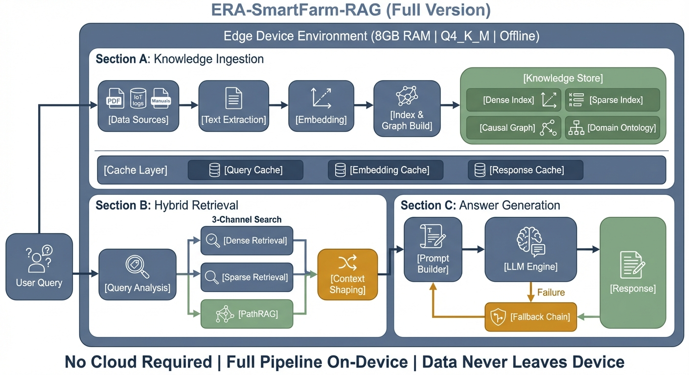

# era-smartfarm-rag Project Pipeline

This document visualizes the end-to-end project pipeline for **era-smartfarm-rag**, from asset preparation to edge deployment.

## Project Pipeline Overview

The pipeline consists of three main stages:
1.  **Preparation**: Preparing the necessary assets (GGUF models, FAISS indices) and Docker configurations.
2.  **Integration**: Combining code and assets into a unified Docker Compose environment.
3.  **Deployment**: Deploying and running the system on the target Edge Device (Jetson/On-premise).

