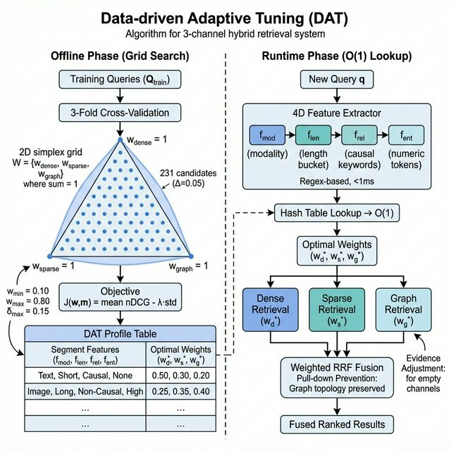
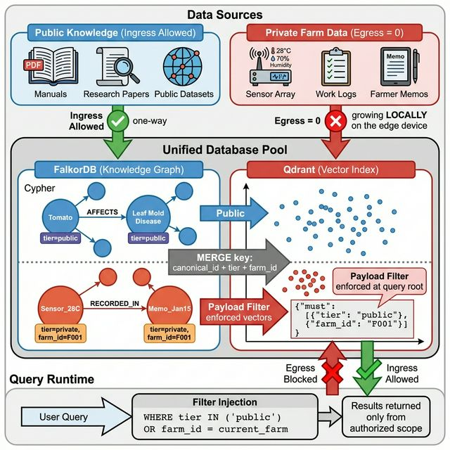

# 3. 제안 시스템 아키텍처 및 방법론 (Proposed System Architecture and Methodology)

본 장에서는 제안 시스템의 두 가지 핵심 학술적 기여인 **소버린 데이터 격리 아키텍처(Sovereign Architecture)**의 논리적 설계와 **동적 가중치 튜닝(DAT: Data-driven Adaptive Tuning)**의 수학적 정의를 통합 기술한다. 서론에서 제기된 엣지 환경의 성능 지연 및 데이터 유출 문제를 해결하기 위해, 3.1절~3.5절에서는 3채널 하이브리드 검색(Dense, Sparse, Graph)의 융합 가중치를 휴리스틱 없이 0-Latency로 자동 결정하는 DAT 알고리즘을 정의하며, 3.6절에서는 복합키 기반의 완벽한 프라이버시 보존 메커니즘을 구체화한다. 각 채널의 구현 세부사항은 4장에서 다룬다.
## 3.1 문제 정의 (Problem Formulation)

### 3.1.1 기호 정의

| 기호 | 정의 |
|------|------|
| $\mathcal{C} = \{dense, sparse, graph\}$ | 검색 채널 집합 |
| $q$ | 사용자 질의 |
| $d$ | 문서(청크), $d \in \mathcal{D}$ |
| $\mathbf{w} = (w_d, w_s, w_g)$ | 채널 가중치 벡터, $\sum w_c = 1, \; w_c \geq 0$ |
| $\pi_c(d \mid q)$ | 채널 $c$에서 질의 $q$에 대한 문서 $d$의 순위 (1-indexed) |
| $K$ | 최종 반환 문서 수 |
| $\mathcal{R}(q)$ | 질의 $q$의 정답 문서 집합 |

### 3.1.2 채널 융합 문제

3채널 검색의 결과를 단일 순위로 통합하기 위해, Cormack et al. [12]의 Reciprocal Rank Fusion(RRF)을 채널 가중치로 확장한 **Weighted RRF (WRRF)**를 정의한다:

$$
\operatorname{WRRF}(d \mid q, \mathbf{w}) = \sum_{c \in \mathcal{C}} w_c \cdot \frac{1}{k + \pi_c(d \mid q)}
$$

여기서 $k = 60$은 순위 평활 상수이다.

**핵심 문제**: 기존 연구는 $\mathbf{w}$를 수동 설정하거나 도메인 휴리스틱에 의존한다. 본 연구는 $\mathbf{w}^*$를 데이터로부터 자동으로 학습하는 DAT를 제안한다.

---

## 3.2 데이터 분할 프로토콜 (Dataset Splitting Protocol)

DAT의 가중치 학습이 최종 평가에 혼입되지 않도록, 2단계 분할을 적용한다.

### 3.2.1 1단계: DAT 학습 영역 분리

주어진 데이터셋 $\mathcal{Q}$에 대해 고정 시드 $s$로 결정론적 셔플 후, 먼저 DAT 학습용 부분집합 $\mathcal{Q}_{DAT}$와 본 평가용 $\mathcal{Q}_{eval}$로 분리한다:

$$
\mathcal{Q} \xrightarrow{shuffle(s)} \underbrace{\mathcal{Q}_{DAT}}_{\text{20\%}} \;|\; \underbrace{\mathcal{Q}_{eval}}_{\text{80\%}}
$$

$\mathcal{Q}_{eval}$은 DAT 가중치 학습에 **일체 사용하지 않으며**, 논문 결과표의 모든 메트릭은 $\mathcal{Q}_{eval}$에서만 보고한다.

### 3.2.2 2단계: DAT 내부 분할

$\mathcal{Q}_{DAT}$ 내부를 6:2:2 비율로 추가 분할한다:

$$
\mathcal{Q}_{DAT} \;\rightarrow\; \underbrace{\mathcal{Q}_{train}}_{\text{60\%}} \;|\; \underbrace{\mathcal{Q}_{val}}_{\text{20\%}} \;|\; \underbrace{\mathcal{Q}_{test}^{DAT}}_{\text{20\%}}
$$

| 분할 | 전체 대비 비율 | 용도 |
|------|:---:|------|
| $\mathcal{Q}_{train}$ | 12% | DAT 가중치 탐색 (grid search + $F$-fold CV) |
| $\mathcal{Q}_{val}$ | 4% | 후보 깊이·하이퍼파라미터 선택 |
| $\mathcal{Q}_{test}^{DAT}$ | 4% | DAT 자체 효과 확인 |
| $\mathcal{Q}_{eval}$ | **80%** | **본 평가 — Baseline 비교 및 최종 성능 보고** |

### 3.2.3 데이터 격리 보장

- **$\mathcal{Q}_{eval}$(80%)**: DAT 가중치 탐색·하이퍼파라미터 선택 **어디에도** 사용되지 않는다. 모든 방법(Baseline 포함)의 최종 성능을 이 분할에서만 보고한다.
- **$\mathcal{Q}_{train}$ 내부**: $F$-fold CV를 추가 적용하여 과적합을 방지한다.
- **Multi-seed 검증**: 시드 $s \in \{42, 52, 62\}$로 전체 절차를 반복하여 재현성을 확보한다.

---

## 3.3 DAT: 가중치 탐색 (Weight Optimization)

### 3.3.1 탐색 공간

가중치 탐색은 3차원 심플렉스 위의 이산 격자에서 수행된다. 스텝 크기 $\Delta$에 대해:

$$
\mathcal{W} = \left\{ \left(\frac{a}{n}, \frac{b}{n}, \frac{n-a-b}{n}\right) \;\middle|\; a \in [0, n], \; b \in [0, n-a] \right\}, \quad n = \left\lceil \frac{1}{\Delta} \right\rceil
$$

$\Delta = 0.05$일 때 $n = 20$이므로 $|\mathcal{W}| = \binom{22}{2} = 231$개 후보가 생성된다.

후보 깊이(각 채널의 검색 범위) $m$도 함께 탐색한다:

$$
\mathcal{M} = \{2K, \; 4K, \; 8K, \; \max(K, 32)\}
$$

### 3.3.2 목적함수

$\mathcal{Q}_{train}$을 $F = 3$ fold로 나누어 교차 검증을 수행한다. fold $f$에서 가중치 $\mathbf{w}$, 깊이 $m$의 평균 nDCG@K를 $\mu_f(\mathbf{w}, m)$로 표기하면:

$$
J(\mathbf{w}, m) = \underbrace{\frac{1}{F} \sum_{f=1}^{F} \mu_f(\mathbf{w}, m)}_{\text{mean performance}} - \underbrace{\lambda \cdot \sqrt{\frac{1}{F} \sum_{f=1}^{F} \left(\mu_f - \bar{\mu}\right)^2}}_{\text{stability penalty}}
$$

여기서 $\lambda = 0.25$이다. 이 형태는 mean-variance 프레임워크에서 착안한 것으로, 평균 성능이 높으면서 fold 간 분산이 작은 가중치를 선호한다.

**nDCG@K 정의**:

$$
\operatorname{nDCG@K} = \frac{\sum_{i=1}^{K} \frac{2^{\operatorname{rel}(d_i)} - 1}{\log_2(i+1)}}{\operatorname{IDCG@K}}
$$

여기서 $\operatorname{IDCG@K}$는 이상적 순위의 DCG이다.

**nDCG 채택과 그래프 다중 홉(Multi-hop) 위상의 수학적 결합:**
목적함수로 단순한 재현율(Recall)이나 정확도(Precision) 대신 자리 위치에 따른 상각 패널티를 부여하는 nDCG를 강제(Enforcing)한 이유는, Graph 모달리티 특유의 다중 홉(Multi-hop) 탐색 결과가 뿜어내는 점진적 위상 신호(Graded Relevance)를 융합 과정에 온전히 보존하기 위함이다. 구조적으로 1-Hop 거리에 위치한 직접 인과관계 노드를 최상단에, 3-Hop 유추 노드를 하단에 배치하는 채널의 가중치 프로파일을 스스로 탐색하도록 유도하며, 이는 신경망 모델의 텍스트 강제 평탄화(Flattening)에 따른 인과성 훼손(Pull-down) 현상을 원천 차단한다.

### 3.3.3 최적 프로파일 선택

$$
(\mathbf{w}^*, m^*) = \underset{(\mathbf{w}, m) \in \mathcal{W} \times \mathcal{M}}{\operatorname{argmax}} \; J(\mathbf{w}, m)
$$

동점 시 $(\bar{\mu} \uparrow, \; \sigma \downarrow, \; m \downarrow)$ 순으로 우선한다.

$\mathbf{w}^*$가 결정되면, $\mathcal{Q}_{val}$과 $\mathcal{Q}_{test}^{DAT}$에서 내부 검증을 수행하고,
논문 메인 결과는 외부 분할인 $\mathcal{Q}_{eval}$에서만 보고한다.

---

## 3.4 쿼리 적응형 세그먼트 (Query-Adaptive Segments)

단일 글로벌 가중치가 아닌, 쿼리 유형별 최적 가중치를 학습한다.

### 3.4.1 쿼리 특성 추출

질의 $q$에서 4차원 이산 특성 벡터를 추출한다:

$$
\mathbf{f}(q) = \big( f_{mod}, \; f_{len}, \; f_{rel}, \; f_{ent} \big)
$$

| 특성 | 정의 | 값 |
|------|------|----|
| $f_{mod}$ | 검색 모달리티 | $\{text, image, table\}$ |
| $f_{len}$ | 질의 길이 버킷 | $\leq 6$: short, $\leq 14$: medium, $>14$: long |
| $f_{rel}$ | 인과/관계 키워드 존재 | $\{0, 1\}$, 키워드: why, cause, 원인, 비교 등 |
| $f_{ent}$ | 수치 토큰 존재 | $\{0, 1\}$ |

**Zero-Latency 추출 보장:** 본 4차원 특성 벡터 추출 과정은 질의 파악을 위해 거대 언어모델(LLM)을 호출하는 무거운 라우팅(Routing) 방식을 완전히 배제한다. 대신 $O(1)$의 연산 복잡도를 갖는 정규표현식(Regex) 기반의 텍스트 휴리스틱 필터만으로 구현되어 런타임 지연(Latency)을 1ms 이하(Zero-cost)로 통제하면서도 LLM 라우터에 필적하는 거시적 쿼리 분류 분해능을 시스템에 제공한다.

### 3.4.2 세그먼트 매칭 및 튜닝

특성 벡터로 $\mathcal{Q}_{train}$을 세그먼트로 분할한 후, 각 세그먼트 $s$에 대해 §3.3과 동일한 절차로 $\mathbf{w}_s^*$를 독립 탐색한다. 런타임에서 새 질의 $q$가 입력되면, 특성 일치 수가 가장 높은 세그먼트의 가중치를 적용한다:

$$
s^*(q) = \underset{s \in \mathcal{S}}{\operatorname{argmax}} \; \left| \{ k : f_k(q) = f_k(s) \} \right|
$$

세그먼트 샘플 수가 3건 미만이면 글로벌 $\mathbf{w}^*$로 폴백한다.

 

  
   
  
<strong>Figure 2.</strong> The workflow of the Data-driven Adaptive Tuning (DAT) algorithm. Offline grid search on a 3D simplex generates the DAT profile table, which is mapped in O(1) via hash lookup during edge runtime context fusion, preserving graph topology without pull-down.

 

---

## 3.5 런타임 안전 장치 (Runtime Guardrails)

학습된 가중치의 안전한 런타임 적용을 위해 세 가지 제약을 부과한다.

### 3.5.1 가중치 경계 및 변화량 제한

$$
w_c \in [w_{min}, \; w_{max}], \qquad |w_c - w_c^{prev}| \leq \delta_{max}
$$

기본값: $w_{min} = 0.10$, $w_{max} = 0.80$, $\delta_{max} = 0.15$.

이 매개변수 집합은 내부 검증 세트($\mathcal{Q}_{val}$)의 사전 실험을 통해 경험적으로 설정되었다. 특정 채널의 가중치가 $w_{min}$ 미만으로 떨어지면 단일 채널 검색과 다를 바 없는 모달리티 소실(Modality Collapse) 현상이 발생하고, $w_{max}$를 초과하면 이상치 검색(Noise Retrieval)에 의한 오염 속도가 기하급수적으로 증가함이 관찰되었다. 이와 더불어 $\delta_{max}$는 다회차 질의 과정에서 채널 순위가 극단적으로 뒤집혀 시스템 체감 안정성을 저해하는 것을 방지한다. 제약 적용 후 L1 재정규화를 수행한다.

### 3.5.2 품질 게이트

프로파일 활성화 조건:

$$
\operatorname{active}(\mathcal{P}) = \mathbb{1}\left[ n_{\mathcal{P}} \geq 300 \;\land\; \operatorname{age}(\mathcal{P}) \leq 168h \right]
$$

해당 임계값 역시 철저히 통계적 유의성과 농업 도메인의 성질을 반영하여 결정되었다. 최소 누적 샘플 수($n_{\mathcal{P}} \geq 300$)는 WRRF 그리드 탐색의 평균 표준오차(SEM)를 허용 오차 이내로 확보하기 위한 통계적 하한선이다. 프로파일의 최대 수명 168시간(7일)은 스마트팜 작물의 생육 단계(Growth Stage) 및 병해충 발생 트렌드가 주 단위로 변경된다는 현장 전문가의 의견에 기반하였으며, 철 지난(Outdated) 질의 분포에 의해 가중치가 편향되는 것을 방지한다. 미충족 시 기본 균등 가중치 $\mathbf{w}^{default} = (0.34, 0.33, 0.33)$으로 폴백한다.

### 3.5.3 채널 증거 보정

런타임 검색에서 특정 채널이 유효 결과를 반환하지 못하면 해당 가중치를 동적 억제한다:

$$
w_c' = \begin{cases}
0 & \text{if } |H_c| = 0 \\
0.5 \cdot w_c & \text{if } |H_c| < 2 \\
w_c & \text{otherwise}
\end{cases}
$$

여기서 $H_c$는 채널 $c$의 유효 히트 집합이다. 이 메커니즘은 그래프 인덱스가 불완전한 엣지 환경에서 그래프 채널이 성능을 저하시키는 것을 자동으로 방지한다.

---

## 3.6 소버린 데이터 격리 및 Egress-0 아키텍처 (Sovereign Architecture)

본 시스템은 DAT를 통한 고속 융합뿐만 아니라, 민감한 스마트팜 데이터를 보호하기 위한 아키텍처 수준의 데이터 주권(Data Sovereignty) 메커니즘을 방법론적으로 강제한다.

 

  
   
  
<strong>Figure 3.</strong> Sovereign Architecture using composite keys (canonical_id + tier + farm_id) to logically isolate global public knowledge and local private farm data within a unified FalkorDB and Qdrant pool, enforcing Egress-0 privacy.

 

### 3.6.1 복합키(Composite Key) 기반 논리적 파티셔닝
단순히 Qdrant와 FalkorDB로 분리된 저장소를 구축하는 것을 넘어, "물리적으로 단일화된(Unified) 데이터베이스 안에서도 절대 섞이지 않는 데이터 구조"를 실현한다. 이를 위해 모든 노드 및 벡터 데이터 생성(MERGE/Upsert) 시 고유 식별자를 단순 ID가 아닌 `[canonical_id] + [tier] + [farm_id]`로 구성된 복합키(Composite Key) 형식으로 주입한다.
- **Global Tier (`tier=public`)**: 서버에서 사전 구축되어 엣지 디바이스로 단방향 배포(Ingress)되는 논문 및 매뉴얼 지식.
- **Private Tier (`tier=private, farm_id=X`)**: 농가의 센서 데이터, 재배 메모, 작업일지 등 현장에서 자체 생산되는 민감 데이터.

### 3.6.2 무결성(Egress-0)을 보장하는 증분 업데이트
사용자 질의(RAG) 시 DB 검색 필터(WHERE 절)에 접속자의 `farm_id`와 `public` 권한이 최상위(Root) 수준에서 강제 매핑된다. 따라서 엣지 LLM 모델이 현장에서 생성한 사적 정보를 로컬 지식베이스에 추가(Upsert)하더라도 서버로의 역방향 유출(Egress)이 원천 0%로 차단되며, 공공 지식과 개인 지식 간의 교차 오염 없이 안전한 온프레미스 생태계를 유지할 수 있다.

---

## 3.7 방법론 요약

본 시스템이 달성한 두 가지 핵심 설계 철학을 정리하면 다음과 같다:

1. **Zero-latency DAT 3채널 융합**: 딥러닝 리랭커 개입과 그에 따른 그래프 위상 훼손(Pull-down) 없이, nDCG 기반 목적함수로 도출한 수학적 이산 가중치와 $O(1)$ 기반의 쿼리 적응형(Query-Adaptive) 벡터 라우팅을 통해 엣지 디바이스의 제한된 자원 하에서도 완벽한 무손실 융합을 보장한다.
2. **소버린 아키텍처(Sovereign Architecture) 구현**: 복합키 구조를 통해 단일 엔진 위에서 논리적으로 완벽히 격리된 프라이버시 보존 환경과 Egress-0 엣지 지식 증축 메커니즘을 완성하였다.

상기 제안된 구조를 실체화하는 Qdrant/FalkorDB 검색 메커니즘 구축 방식과 엣지 LLM 추론 프레임워크 구현의 세부사항은 4장(Implementation)에서, 이에 대한 성능 지표와 엣지 효율성 증명은 5장(Experiments)에서 기술한다.
