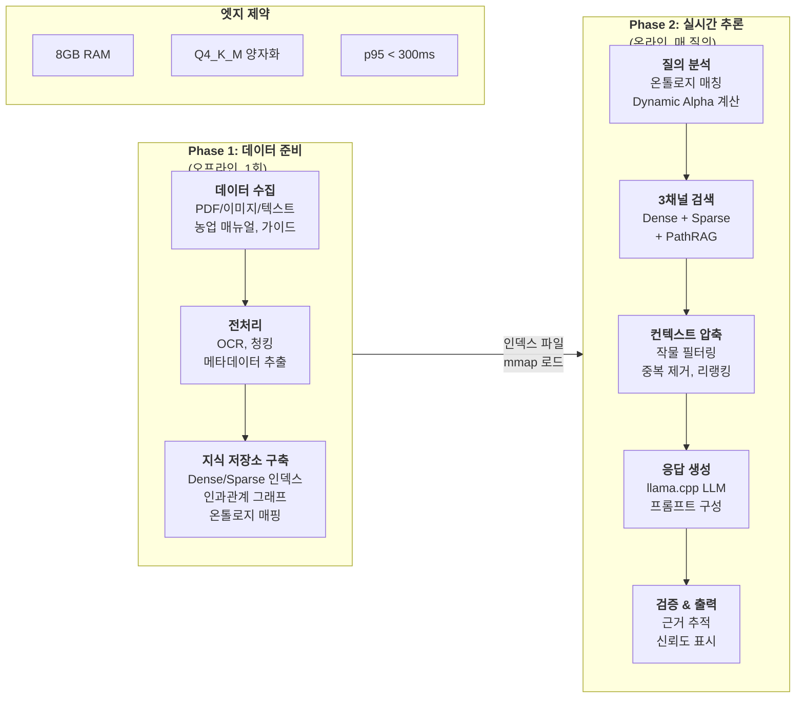

# 3. 제안 방법론 (Proposed Methodology)

## 3.1 전체 시스템 개요 및 처리 흐름

본 연구는 스마트팜 현장의 자원 제약 환경(8GB RAM)에서 근거 기반 실시간 응답을 제공하는 온디바이스 RAG 시스템을 제안한다. 시스템은 **데이터 수집 및 전처리 → 지식 저장소 구축 → 하이브리드 검색 → 컨텍스트 압축 → 응답 생성 → 검증**의 6단계 파이프라인으로 구성되며, 각 단계는 엣지 환경의 메모리/연산 제약을 고려하여 설계되었다.

### 3.1.1 End-to-End 처리 흐름 (Figure 1)



**핵심 설계 원칙:**

1. **오프라인 사전 구축**: 인덱싱/그래프 구축은 1회 오프라인으로 수행하여 런타임 부하 최소화
2. **메모리 효율**: mmap 기반 lazy loading으로 전체 인덱스를 RAM에 올리지 않음
3. **도메인 특화**: 농업 온톨로지와 인과관계 그래프로 범용 RAG 대비 검색 품질 향상
4. **검증 내장**: 근거 문서 추적과 신뢰도 표시로 환각 위험 완화

### 3.1.2 시스템 아키텍처 (6계층 스택)

본 시스템은 스마트팜 도메인에 특화된 온디바이스 하이브리드 RAG로, 6계층 스택 아키텍처로 구성된다.

### 3.1.3 리소스 제약 및 설계 목표

엣지 환경의 리소스 제약을 명확히 정의하고, 이를 기반으로 각 컴포넌트를 설계하였다.

| 리소스 항목 | 최소 사양 | 권장 사양 | 설계 근거 |
|------------|----------|----------|----------|
| **RAM** | 8GB | 16GB | Jetson Orin Nano 타겟 |
| **저장공간** | 10GB | 20GB | GGUF 모델 + FAISS 인덱스 |
| **목표 지연** | p95 < 500ms | p95 < 300ms | 실시간 현장 응답 |
| **LLM 메모리** | ~2.5GB | ~4GB | Q4_K_M 양자화 기준 |
| **처리량** | 3 QPS | 8 QPS | CPU 단독 환경 |

### 3.1.4 6계층 아키텍처 (Figure 2)


**계층별 핵심 역할**:

| 계층 | 역할 | 핵심 컴포넌트 |
|------|------|--------------|
| **L5** | 사용자 인터페이스 및 정책 | FastAPI, Streamlit, 폴백 정책 |
| **L4** | 응답 생성 및 그라운딩 | 프롬프트 템플릿, 템플릿 응답기 |
| **L3** | 컨텍스트 압축 (논문 핵심) | 작물 필터, 중복 제거, 리랭킹 |
| **L2** | 3채널 하이브리드 검색 | Dense, Sparse, PathRAG 융합 |
| **L1** | 온디바이스 지식 저장소 | FAISS 인덱스, 인과관계 그래프, 온톨로지 |
| **L0** | 디바이스 런타임 | llama.cpp, 임베딩 모델, FAISS |

---

## 3.2 데이터 수집 및 전처리 파이프라인

### 3.2.1 데이터 수집

본 연구의 지식 베이스는 다음 세 가지 유형의 농업 문서로 구성된다.

| 데이터 유형 | 출처 | 형식 | 수량 |
|------------|------|------|------|
| **재배 매뉴얼** | 농촌진흥청, 도농업기술원 | PDF, 이미지 | ~50개 |
| **기술 가이드** | 스마트팜 코리아, 농업기술실용화재단 | 웹 문서, PDF | ~30개 |
| **작업 기록** | 현장 농가 메모, Q&A 게시판 | 텍스트, 이미지 | ~20개 |

**수집 기준:**
- 와사비 재배에 직접 관련된 문서 우선
- 환경 관리(온도, 습도, EC, pH)에 대한 수치 정보 포함 문서
- 병해충 진단 및 해결책이 명시된 문서

### 3.2.2 전처리 파이프라인 (Figure 3)


### 3.2.3 OCR 및 텍스트 정규화

이미지 기반 문서(스캔 PDF, 현장 사진)는 **EasyOCR**을 사용하여 텍스트로 변환한다.

**정규화 규칙:**
- 온도: "25도", "25°C", "섭씨 25도" → `25℃`
- EC: "2.5 dS/m", "EC 2.5", "전기전도도 2.5" → `EC 2.5 dS/m`
- pH: "pH6.5", "산도 6.5" → `pH 6.5`

```python
# 수치 정규화 예시
NORMALIZATION_PATTERNS = {
    r'(\d+\.?\d*)\s*(도|°C|℃|섭씨)': r'\1℃',
    r'(EC|전기전도도)\s*(\d+\.?\d*)': r'EC \2 dS/m',
    r'(pH|산도)\s*(\d+\.?\d*)': r'pH \2',
}
```

### 3.2.4 시맨틱 청킹 전략

단순 길이 기반 분할 대신, 문서의 **의미 구조**를 보존하는 청킹을 적용한다.

| 전략 | 설명 | 토큰 범위 |
|------|------|----------|
| **섹션 기반** | 제목/소제목으로 1차 분할 | 가변 |
| **의미 병합** | 짧은 섹션은 연관 섹션과 병합 | 200-500 |
| **오버랩** | 문맥 연속성을 위한 중복 구간 | 50 |

**청킹 파라미터:**
- `CHUNK_MIN_TOKENS`: 200 (너무 짧은 청크 방지)
- `CHUNK_MAX_TOKENS`: 500 (컨텍스트 윈도우 효율)
- `CHUNK_OVERLAP`: 50 (문맥 연속성)

### 3.2.5 메타데이터 자동 추출

각 청크에 대해 다음 메타데이터를 규칙 기반으로 자동 추출한다.

| 메타데이터 | 추출 방법 | 용도 |
|-----------|----------|------|
| **crop** | 온톨로지 매칭 (작물명 사전) | 작물 필터링 |
| **category** | 키워드 분류기 | 도메인 분석 |
| **causal_role** | 패턴 매칭 (원인/결과/해결 키워드) | PathRAG 그래프 |
| **numeric_info** | 정규표현식 추출 | Sparse 검색 강화 |
| **source** | 원본 파일명 + 페이지 | 근거 추적 |

```python
# 메타데이터 추출 예시
def extract_metadata(chunk_text: str) -> dict:
    return {
        "crop": ontology_matcher.match_crop(chunk_text),
        "category": classify_category(chunk_text),
        "causal_role": detect_causal_role(chunk_text),
        "numeric_info": extract_numeric_values(chunk_text),
        "source": {"file": source_file, "page": page_num}
    }
```

---

## 3.3 스마트팜 온톨로지

### 3.3.1 설계 배경

온톨로지 설계는 Stanford 온톨로지 구축 방법론[13]과 기존 농업 온톨로지 연구[9,10,11]를 참조하여 스마트팜 도메인에 적합한 6개 개념 유형을 정의하였다. CropDP-KG[12]의 엔티티 구조와 AgriKG[21]의 농업 엔티티 분류를 참고하여 한국 스마트팜 환경에 맞게 구성하였다.

### 3.3.2 개념 유형 정의 (Figure 4)


| 유형 | 설명 | 예시 | 근거 |
|------|------|------|------|
| **crop** | 재배 작물 | 와사비, 토마토, 딸기 | CropDP-KG의 Crops Name 엔티티[12] |
| **env** | 환경 요소 | 온도, 습도, EC, pH, CO2 | 스마트팜 IoT 센서 데이터 표준[11] |
| **nutrient** | 영양소 | 양액, 비료, 관수 | 농업 지식 베이스[9] |
| **disease** | 병해충 | 흰가루병, 뿌리썩음병, 연부병 | CropDP-KG의 Disease/Pest 분류[12,13] |
| **stage** | 생육 단계 | 육묘, 정식, 생육, 수확 | 작물 생육 모델[17] |
| **practice** | 재배 실천 | 차광, 환기, 난방, 살균 | 농업 실천 온톨로지[9,10] |

각 개념은 동의어/유의어 목록(alias)을 포함한다. 예를 들어 "와사비"의 alias에는 "산와사비", "본와사비"가 포함되어 사용자가 어떤 표현을 쓰더라도 동일 개념으로 인식한다.

---

## 3.4 3채널 하이브리드 검색 (HybridDAT)

### 3.4.1 설계 근거

Dense retrieval은 의미적 유사성 검색에 강하지만 "EC 2.5 dS/m" 같은 수치 정보 매칭에 취약하다. Sparse retrieval은 정확한 키워드 매칭에 강하지만 의미적 유사성을 놓칠 수 있다[5]. 본 시스템은 Dense-Sparse-PathRAG 3채널 융합과 질의 특성에 따른 동적 가중치 조정(Dynamic Alpha Tuning)을 적용한다.

### 3.4.2 HybridDATRetriever 플로우 (Figure 5)


### 3.4.3 동적 가중치 규칙 (Dynamic Alpha)

질의 내용을 분석하여 가중치를 자동 결정한다:

| 질의 특성 | Dense (α_d) | Sparse (α_s) | PathRAG (α_p) | 설계 근거 |
|----------|-------------|--------------|---------------|----------|
| 일반 질의 | 0.5 | 0.5 | 0.0 | 의미 검색과 키워드 매칭 균형 |
| 수치/단위 포함 ("EC 2.5", "25℃") | 0.3 | 0.7 | 0.0 | 수치는 정확히 일치해야 함[4] |
| 병해/재배 관련 ("흰가루병 원인") | 0.35 | 0.35 | 0.3 | 인과관계 탐색 활성화 |

---

## 3.5 인과관계 그래프 (PathRAG-lite)

### 3.5.1 설계 배경

농업 도메인에서 "고수온 → 연부병 발생 → 수온 관리" 같은 인과 체인이 핵심 정보 구조를 형성한다[17]. GraphRAG[7]는 LLM으로 개체와 관계를 추출하므로 구축 비용이 높다(문서 1000개당 GPT-4 $100+). 본 시스템은 규칙 기반 패턴 매칭으로 인과관계 그래프를 구축하여 비용을 $0으로 절감한다.

### 3.5.2 인과관계 역할 분류

텍스트 패턴 매칭으로 문서의 역할을 분류한다:

| 역할 | 판별 패턴 | 예시 문장 |
|------|----------|----------|
| **Cause** | "원인", "때문", "~하면", "높으면", "낮으면" | "고온 환경에서는 화분 활력이 저하된다" |
| **Effect** | "결과", "증상", "문제", "장애", "저하" | "착과율이 떨어지는 문제가 발생한다" |
| **Solution** | "관리", "해야", "방법", "조치", "예방" | "야간 온도를 18℃ 이하로 관리해야 한다" |

### 3.5.3 PathRAG-lite BFS 탐색 (Figure 6)

PathRAG[8]의 경로 탐색 개념을 차용한 경량 구현이다. BFS(너비 우선 탐색) 기반 2-hop 탐색으로 원인→결과→해결책 문서를 수집한다.


### 3.5.4 그래프 스키마

CropDP-KG[12]와 AgriKG[21]의 스키마 설계를 참조하여 구성하였다.

**노드 타입**: practice(문서), crop, env, disease, nutrient, stage

**엣지 타입**:

| 타입 | 의미 | 참조 |
|------|------|------|
| recommended_for | 작물 → 실천 | AgriKG[21] |
| associated_with | 병해 → 실천 | CropDP-KG[12] |
| mentions | 실천 → 개념 | 농업 온톨로지[10] |
| **causes** | 실천 → 실천 | 인과 추출[14,15] |
| **solved_by** | 실천 → 실천 | 인과 추출[14,15] |

---

## 3.6 Context Shaping (컨텍스트 압축)

엣지 LLM은 토큰이 곧 지연/전력 비용이므로, 검색 결과를 그대로 전달하지 않고 압축/필터링하는 것이 핵심이다.

### 3.6.1 Context Shaping 파이프라인 (Figure 7)


### 3.6.2 작물 필터링 (Crop-aware Filtering)

농업 지식 그래프 연구[4,12]에서 작물별 맥락 의존성이 강조되었다. 질의의 작물과 문서의 작물 메타데이터를 비교하여 스코어를 조정한다.

| 조건 | 스코어 조정 | 효과 |
|------|------------|------|
| 작물 일치 | +0.5 | 관련 문서 우선 |
| 작물 불일치 | ×0.15 | 무관한 작물 정보 억제 |
| 작물 정보 없음 | 유지 | 일반 정보 보존 |

### 3.6.3 시맨틱 중복 제거 (Semantic Deduplication)

MMR[18]과 VRSD[19]를 참조하여 검색 결과의 다양성을 확보한다. 두 문서의 임베딩 벡터 간 코사인 유사도가 임계값(θ=0.85) 이상인 문서 쌍에서 후순위 문서를 제거한다.

### 3.6.4 메모리 적응형 리랭킹

런타임 가용 메모리에 따라 리랭커를 동적으로 선택한다:

| 가용 RAM | 리랭커 | 추가 메모리 | 설명 |
|----------|--------|------------|------|
| < 0.8GB | none | 0MB | 리랭킹 비활성화 |
| 0.8GB ~ 1.5GB | LLM-lite | ~0MB | llama.cpp 재사용 |
| ≥ 1.5GB | BGE | ~500MB | BGE-reranker-v2-m3 |

---

## 3.7 엣지 배포 최적화

### 3.7.1 메모리 계층 구조 (RAM vs Flash)

엣지 환경에서 "벡터 인덱스가 RAM에 다 못 올라간다"는 병목을 해결하기 위해 계층적 메모리 구조를 설계하였다.


### 3.7.2 LLM 양자화 전략

llama.cpp의 GGUF 포맷[23]을 활용하여 Q4_K_M 양자화를 기본으로 적용한다.

| 양자화 수준 | 메모리 (4B 모델) | 품질 손실 | 적용 환경 |
|------------|-----------------|----------|----------|
| FP16 (원본) | ~8GB | 없음 | 서버 환경 (GPU 필수) |
| INT8 | ~4GB | 최소 | 고사양 엣지 (8GB RAM) |
| **Q4_K_M** | ~2.5GB | 낮음 | **일반 엣지 (권장)** |
| Q2_K | ~1.5GB | 중간 | 극저사양 환경 |

Q4_K_M은 중요한 레이어는 5비트, 나머지는 4비트로 혼합 양자화하여 품질 대비 메모리 효율의 최적점으로 평가된다.

### 3.7.3 오프라인 폴백 모드 (Figure 8)

네트워크 단절 또는 LLM 장애 시 다음과 같은 폴백 전략을 적용한다:


| 폴백 단계 | 동작 | 언제 사용 |
|----------|------|----------|
| **Similar Cache** | 이전 유사 질의 응답 재활용 | 반복/유사 질의 시 |
| **Template Response** | 온톨로지 기반 정형 응답 생성 | 간단한 조회 시 |
| **Search Only** | LLM 없이 검색 결과만 반환 | LLM 완전 불가 시 |

---

## 3.8 응답 검증 및 근거 추적 (Verification)

엣지 환경에서 LLM의 환각(hallucination) 위험을 완화하기 위해 다음과 같은 검증 메커니즘을 적용한다.

### 3.8.1 근거 추적 (Source Attribution)

생성된 응답의 각 주장에 대해 근거 문서를 명시적으로 연결한다.


**구현 방식:**
1. LLM 프롬프트에 검색된 문서와 함께 "근거를 명시하라"는 지시 포함
2. 응답 생성 후, 주장-문서 간 임베딩 유사도 계산
3. 유사도가 임계값(0.7) 미만인 주장에 대해 경고 표시

### 3.8.2 환각 감지 메커니즘 (Figure 9)


### 3.8.3 수치 정보 검증

농업 도메인에서 수치 정보의 정확성은 특히 중요하다. 다음과 같은 규칙 기반 검증을 적용한다.

| 검증 항목 | 방법 | 예시 |
|----------|------|------|
| **범위 검증** | 도메인 지식 기반 허용 범위 | 수온 10-25℃, pH 5.5-7.5 |
| **일관성 검증** | 근거 문서 내 수치와 비교 | 응답 "18℃" vs 문서 "18℃" ✓ |
| **단위 검증** | 단위 변환 정확성 확인 | EC 2.5 dS/m ≠ 2500 µS/cm 표기 주의 |

### 3.8.4 신뢰도 표시 및 폴백

최종 응답에는 다음 정보가 함께 제공된다:

```json
{
  "answer": "와사비의 적정 수온은 13-17℃입니다...",
  "confidence": "HIGH",
  "sources": [
    {"chunk_id": "chunk_042", "title": "와사비재배 매뉴얼", "page": 15, "similarity": 0.92}
  ],
  "warnings": [],
  "fallback_used": false
}
```

**신뢰도 수준 정의:**

| 수준 | 조건 | 사용자 안내 |
|------|------|-----------|
| **HIGH** | 모든 주장에 유사도 ≥0.8 근거 존재 | 응답 신뢰 가능 |
| **MEDIUM** | 일부 주장만 근거 확인 (≥60%) | 추가 확인 권장 |
| **LOW** | 근거 확인 불가 (<60%) | 전문가 상담 권장 |

---

## 3.9 관련 연구와의 비교

### 3.9.1 EdgeRAG vs ERA-SmartFarm-RAG

| 구분 | EdgeRAG[24] | ERA-SmartFarm-RAG |
|------|-------------|-------------------|
| **최적화 초점** | 범용 메모리 최적화 | 도메인 특화 + 엣지 배포 |
| **인덱싱 전략** | 온라인 계층적 인덱싱 | 오프라인 사전 인덱싱 + mmap |
| **검색 채널** | 단일 Dense | **Dense + Sparse + PathRAG** |
| **그래프 활용** | 없음 | **인과관계 그래프** |
| **도메인 지식** | 범용 | **농업 온톨로지 6개 유형** |
| **메모리 절감** | 계층적 로딩 50%↓ | **양자화 75%↓ + mmap** |
| **오프라인 지원** | 제한적 | **폴백 체인 (Cache→Template→Search)** |

### 3.9.2 MobileRAG 패턴 비교

| 구분 | MobileRAG (EcoVector+SCR) | ERA-SmartFarm-RAG |
|------|---------------------------|-------------------|
| **인덱스 파티셔닝** | k-means 클러스터 계층 | FAISS mmap (전체 인덱스) |
| **부분 로딩** | 클러스터별 on-demand | mmap lazy load (OS 페이지 캐시) |
| **토큰 절감** | SCR (Selective Content Reduction) | **Semantic Dedup + Crop Filter** |
| **런타임** | AI Edge / MLX | **llama.cpp GGUF** |

### 3.9.3 핵심 차별점

1. **도메인 특화**: 범용 메모리 최적화 대신 농업 온톨로지와 인과관계 그래프 활용
2. **3채널 검색**: 수치/단위 정보(EC, pH)의 정확한 매칭을 위한 Sparse 채널 유지
3. **경량 Context Shaping**: SCR 대신 Semantic Dedup + Crop Filter (구현 단순화)
4. **완전 오프라인**: Template Responder로 LLM 없이도 기본 응답 가능

---

## 참조

> 상세 Mermaid 다이어그램: [figures/ARCHITECTURE_MERMAID.md](figures/ARCHITECTURE_MERMAID.md)
> 
> 최신 연구 동향 및 기술 사양: [supplementary/architecture_details.md](supplementary/architecture_details.md)
