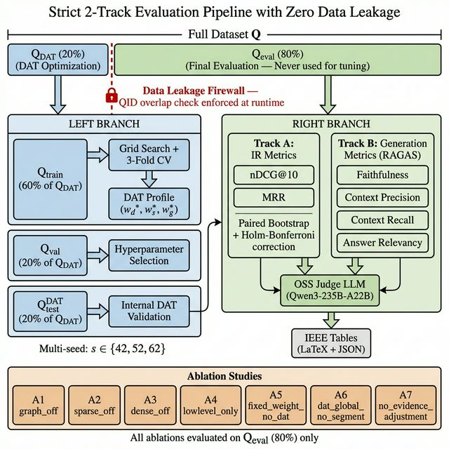

# 5. 실험 및 평가 (Experiments)

## 5.1 실험 목표
본 장의 목적은 다음 네 가지를 검증하는 것이다.

1. DAT 기반 3채널 융합이 고정 융합 대비 어떤 성능 특성을 보이는가
2. Graph 채널의 잠재적 성능 저하를 완화하는가
3. 질의 유형 적응(세그먼트)과 evidence 보정의 기여가 분리되어 관찰되는가
4. 엣지 실행 관점에서 지연/메모리 측정 경로가 준비되었는가

## 5.2 데이터셋 및 평가 설정

### 5.2.1 공통 IR 벤치마크
- AgXQA
- 2WikiMultiHopQA
- HotpotQA

모든 메인 비교는 동일한 retrieval top-k 설정과 multi-seed 프로토콜로 수행한다.

### 5.2.2 DAT 분할 규약
데이터 누출 방지를 위해 dataset별로
- 외부: 20%(DAT tune) / 80%(final eval)
- 내부: 60/20/20(train/val/dat_test)
를 사용한다.

논문 메인 표의 성능은 외부 eval(80%)에서만 보고한다.

### 5.2.3 생성 평가
생성 평가는 RAGAS 경로를 사용하며, retrieval-only 실험과 분리해 보고한다.

 

  
   
  
<strong>Figure 4.</strong> The strict 2-track evaluation setup ensuring zero data leakage. The full query dataset is deterministically split into DAT Optimization (20%) and Unseen Evaluation (80%), with QID overlap checks enforced at runtime. All ablations (A1–A7) are evaluated exclusively on the 80% unseen partition.

 

## 5.3 비교 방법

### 5.3.1 Baselines
- `bm25_only`
- `dense_only`
- `rrf`
- `graph_only`
- `lightrag`

### 5.3.2 Proposed
- `ours_structural` (DAT + segment + evidence adjustment)

## 5.4 Ablation 설계

- A1 `graph_off`
- A2 `sparse_off`
- A3 `dense_off`
- A4 `lowlevel_only`
- A5 `fixed_weight_no_dat`
- A6 `dat_global_only_no_segment`
- A7 `no_evidence_adjustment`

A5~A7은 이전 proxy 실험을 제거하고, DAT 기여 분해 실험으로 재정의하였다.

## 5.5 통계 검정 및 게이트
메인 비교는 다음을 동시에 만족해야 통과로 정의한다.

1. strongest baseline 대비 nDCG@10, MRR 절대 향상 임계치 충족
2. paired bootstrap 기반 유의성 검정
3. 다중비교 보정(Holm-Bonferroni) 통과

## 5.6 와사비 도메인 평가
와사비 질의/코퍼스/qrels 기반 로컬 도메인 세트를 별도 트랙으로 운영한다.
이 트랙은 공용 벤치마크와 동일한 평가 코드 경로를 사용하되, 도메인 특화 성능 해석(재배 지식 일관성, 용어 적합성)을 보조 분석으로 보고한다.

## 5.7 엣지 평가 정책
본 사이클에서는 실제 엣지 디바이스 실측값 보고 대신, 실측 준비가 완료된 측정 harness만 검증한다.

- 측정 항목: p50/p95/p99, TTFT, RSS peak, QPS
- 성공 라운드가 0이면 실험 실패로 처리
- 실디바이스 결과는 후속 실험 장에서 별도 보고

## 5.8 재현 절차
재현 절차는 단일 공식 경로로 고정한다.

1. `run_main_eval` 실행
2. `ablation` 실행
3. `edge_profile` 실행
4. `generate_ieee_tables`로 표 생성

구형 `track_a/track_b/run_suite` 경로는 제거되었으며 호환 래퍼를 제공하지 않는다.
