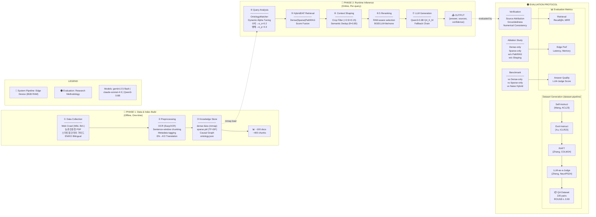

# ERA-SmartFarm-RAG 시스템 아키텍처 Figure 디자인 참고자료

> **목적**: 엣지 환경용 스마트팜 도메인 특화 RAG 시스템의 논문 Figure 작성을 위한 상세 디자인 가이드

---

## 0. 메인 피겨: 3-Column 가로 배치 아키텍처 (Figure 1 - 논문 핵심)

> **설계 원칙**: System Pipeline(Phase 1, 2)과 Evaluation Protocol을 **3개 컬럼**으로 가로 배치하여 한눈에 전체 연구 파이프라인 파악
> 
> - **Left Column (Blue)**: Phase 1 - 데이터 수집 및 인덱스 구축 (Offline)
> - **Center Column (Blue)**: Phase 2 - 런타임 추론 (Online)
> - **Right Column (Orange)**: Evaluation Protocol - 데이터셋 생성 + 검증/평가 방법론

### 0.1 3-Column Horizontal Layout (권장 메인 피겨)

```
┏━━━━━━━━━━━━━━━━━━━━━━━━━━━━━━━━━━━━━━━━━━━━━━━━━━━━━━━━━━━━━━━━━━━━━━━━━━━━━━━━━━━━━━━━━━━━━━━━━━━━━━━━━━━━━━━━━━━━━━━━━━━━━━━━━┓
┃                                    ERA-SmartFarm-RAG: End-to-End Research Pipeline                                              ┃
┣━━━━━━━━━━━━━━━━━━━━━━━━━━━━━━━━━━━━┳━━━━━━━━━━━━━━━━━━━━━━━━━━━━━━━━━━━━━━━┳━━━━━━━━━━━━━━━━━━━━━━━━━━━━━━━━━━━━━━━━━━━━━━━━━━━━━┫
┃  🔵 PHASE 1: Data & Index Build    ┃  🔵 PHASE 2: Runtime Inference        ┃  🟠 EVALUATION PROTOCOL                             ┃
┃      (Offline, One-time)           ┃      (Online, Per-query)              ┃      (Research Methodology)                         ┃
┣━━━━━━━━━━━━━━━━━━━━━━━━━━━━━━━━━━━━╋━━━━━━━━━━━━━━━━━━━━━━━━━━━━━━━━━━━━━━━╋━━━━━━━━━━━━━━━━━━━━━━━━━━━━━━━━━━━━━━━━━━━━━━━━━━━━━┫
┃                                    ┃                                       ┃                                                     ┃
┃  ┌──────────────────────────────┐  ┃  ┌─────────────────────────────────┐  ┃  ┌─────────────────────────────────────────────┐   ┃
┃  │ ① DATA COLLECTION            │  ┃  │ ④ QUERY ANALYSIS                │  ┃  │ DATASET GENERATION (dataset-pipeline)       │   ┃
┃  │ ─────────────────────────    │  ┃  │ ─────────────────────────       │  ┃  │ ─────────────────────────────────────       │   ┃
┃  │ Sources:                     │  ┃  │ • OntologyMatcher.match()       │  ┃  │ ┌─────────────┐  ┌─────────────────────┐    │   ┃
┃  │ • Web Crawl (Wiki, Brit.)    │  ┃  │ • Dynamic Alpha Tuning:         │  ┃  │ │Self-Instruct│─►│ Question Generation │    │   ┃
┃  │ • 농촌진흥청 PDF              │  ┃  │   ┌───────────────────────────┐ │  ┃  │ │(Wang, ACL23)│  │ Seed → Diverse Q's  │    │   ┃
┃  │ • 스마트팜코리아 가이드       │  ┃  │   │ 수치/단위 → α_s +0.2     │ │  ┃  │ └─────────────┘  └──────────┬──────────┘    │   ┃
┃  │                              │  ┃  │   │ 환경/영양 → α_s +0.1     │ │  ┃  │ ┌─────────────┐             │               │   ┃
┃  │ Format:                      │  ┃  │   │ 병해/재배 → α_p ~0.3-0.4 │ │  ┃  │ │Evol-Instruct│─►──────────►│               │   ┃
┃  │ • PDF, Images, Text          │  ┃  │   └───────────────────────────┘ │  ┃  │ │(Xu, ICLR23) │  Complexity │               │   ┃
┃  │ • EN/KO Bilingual            │  ┃  └──────────────┬──────────────────┘  ┃  │ └─────────────┘  Evolution  ▼               │   ┃
┃  └──────────────┬───────────────┘  ┃                 │                     ┃  │ ┌─────────────┐  ┌─────────────────────┐    │   ┃
┃                 │                  ┃                 ▼                     ┃  │ │    RAFT     │─►│ Answer Generation   │    │   ┃
┃                 ▼                  ┃  ┌─────────────────────────────────┐  ┃  │ │(Zhang,COLM24│  │ Context-grounded    │    │   ┃
┃  ┌──────────────────────────────┐  ┃  │ ⑤ HYBRID RETRIEVAL (HybridDAT) │  ┃  │ └─────────────┘  └──────────┬──────────┘    │   ┃
┃  │ ② PREPROCESSING              │  ┃  │ ─────────────────────────────  │  ┃  │                            │               │   ┃
┃  │ ─────────────────────────    │  ┃  │ ┌─────────┬─────────┬────────┐ │  ┃  │                            ▼               │   ┃
┃  │ • Text extraction            │  ┃  │ │  Dense  │ Sparse  │PathRAG │ │  ┃  │ ┌─────────────┐  ┌─────────────────────┐    │   ┃
┃  │ • OCR fallback (EasyOCR)     │  ┃  │ │  FAISS  │ TF-IDF  │BFS 2hop│ │  ┃  │ │LLM-as-Judge │─►│ Quality Evaluation  │    │   ┃
┃  │ • Sentence-window chunking   │  ┃  │ │  α_d    │  α_s    │  α_p   │ │  ┃  │ │(Zheng,Neu24)│  │ Groundedness check  │    │   ┃
┃  │   (CHUNK_SIZE/STRIDE)        │  ┃  │ └────┬────┴────┬────┴───┬────┘ │  ┃  │ │+ Prometheus │  │ Accuracy scoring    │    │   ┃
┃  │ • Metadata tagging:          │  ┃  │      └─────────┴────────┘      │  ┃  │ │(Kim, Neu24) │  │ Completeness eval   │    │   ┃
┃  │   crop, causal, numeric      │  ┃  │              │ Score Fusion    │  ┃  │ └─────────────┘  └──────────┬──────────┘    │   ┃
┃  │ • EN→KO Translation          │  ┃  │              ▼                 │  ┃  │                            │               │   ┃
┃  │   (gemini-2.5-flash)         │  ┃  │   final = α_d×D + α_s×S + α_p×P│  ┃  │                            ▼               │   ┃
┃  └──────────────┬───────────────┘  ┃  └──────────────┬──────────────────┘  ┃  │               ┌─────────────────────┐      │   ┃
┃                 │                  ┃                 │                     ┃  │               │ 📦 QA Dataset        │      │   ┃
┃                 ▼                  ┃                 ▼                     ┃  │               │ • 220 QA pairs       │      │   ┃
┃  ┌──────────────────────────────┐  ┃  ┌─────────────────────────────────┐  ┃  │               │ • 6 categories       │      │   ┃
┃  │ ③ KNOWLEDGE STORE            │  ┃  │ ⑥ CONTEXT SHAPING              │  ┃  │               │ • ROUGE-L 0.93       │      │   ┃
┃  │ ─────────────────────────    │  ┃  │ ─────────────────────────────  │  ┃  │               │ • Groundedness 0.52  │      │   ┃
┃  │ ┌──────────────────────────┐ │  ┃  │ ┌───────────────────────────┐  │  ┃  │               └─────────────────────┘      │   ┃
┃  │ │ dense.faiss (mmap)       │ │  ┃  │ │ Crop Filter               │  │  ┃  └─────────────────────────────────────────────┘   ┃
┃  │ │ • FAISS IndexFlatIP      │ │  ┃  │ │ • match: +0.5             │  │  ┃                                                     ┃
┃  │ │ • MiniLM / Qwen3-Emb     │ │  ┃  │ │ • mismatch: ×0.15         │  │  ┃  ┌─────────────────────────────────────────────┐   ┃
┃  │ ├──────────────────────────┤ │  ┃  │ └─────────────┬─────────────┘  │  ┃  │ VERIFICATION                                │   ┃
┃  │ │ sparse.pkl               │ │  ┃  │               │                │  ┃  │ ─────────────────────────────────────       │   ┃
┃  │ │ • TfidfVectorizer        │ │  ┃  │               ▼                │  ┃  │ • Source Attribution                        │   ┃
┃  │ │ • Keyword matching       │ │  ┃  │ ┌───────────────────────────┐  │  ┃  │   (claim → document mapping)                │   ┃
┃  │ ├──────────────────────────┤ │  ┃  │ │ Semantic Dedup (θ=0.85)   │  │  ┃  │ • Groundedness Checks                       │   ┃
┃  │ │ Causal Graph (in-memory) │ │  ┃  │ │ • cosine sim ≥ 0.85 제거  │  │  ┃  │   (keyword/source-hit verification)        │   ┃
┃  │ │ • causes, solved_by edges│ │  ┃  │ └─────────────┬─────────────┘  │  ┃  │ • Numerical Consistency                     │   ┃
┃  │ │ • Built from doc metadata│ │  ┃  │               │ Top-k×2 (8)    │  ┃  │   (range/unit validation)                   │   ┃
┃  │ ├──────────────────────────┤ │  ┃  │               ▼                │  ┃  │ • Prompt Constraints                        │   ┃
┃  │ │ ontology.json            │ │  ┃  └──────────────────────────────┬┘  ┃  └─────────────────────────────────────────────┘   ┃
┃  │ │ • 6 types: crop, env,    │ │  ┃                                 │   ┃                                                     ┃
┃  │ │   nutrient, disease,     │◄┼──╋───────────────mmap load─────────┘   ┃  ┌─────────────────────────────────────────────┐   ┃
┃  │ │   stage, practice        │ │  ┃                                     ┃  │ ABLATION STUDY                              │   ┃
┃  │ └──────────────────────────┘ │  ┃  ┌─────────────────────────────────┐  ┃  │ ─────────────────────────────────────       │   ┃
┃  │                              │  ┃  │ ⑥.5 RERANKING (Optional)       │  ┃  │ Component-wise Analysis:                    │   ┃
┃  │ Statistics:                  │  ┃  │ ─────────────────────────────  │  ┃  │ • Dense-only        (w/o Sparse, PathRAG)   │   ┃
┃  │ • ~100 documents             │  ┃  │ Memory-aware selection:        │  ┃  │ • Sparse-only       (w/o Dense, PathRAG)    │   ┃
┃  │ • ~400 chunks                │  ┃  │ ┌────────────────────────────┐ │  ┃  │ • w/o PathRAG       (Dense + Sparse only)   │   ┃
┃  │ • Bilingual EN-KO            │  ┃  │ │ RAM < 0.8GB  → none (skip) │ │  ┃  │ • w/o Context Shaping (no filter/dedup)    │   ┃
┃  └──────────────────────────────┘  ┃  │ │ 0.8-1.5GB   → LLM-lite    │ │  ┃  │ • w/o Dynamic Alpha (fixed α=0.5)          │   ┃
┃                                    ┃  │ │ ≥ 1.5GB     → BGE Reranker│ │  ┃  └─────────────────────────────────────────────┘   ┃
┃                                    ┃  │ └────────────────────────────┘ │  ┃                                                     ┃
┃                                    ┃  │              │ Final Top-k (4) │  ┃  ┌─────────────────────────────────────────────┐   ┃
┃                                    ┃  └──────────────┬──────────────────┘  ┃  │ BENCHMARK (Internal Baselines)              │   ┃
┃                                    ┃                 │                     ┃  │ ─────────────────────────────────────       │   ┃
┃                                    ┃                 ▼                     ┃  │ Comparison Targets:                         │   ┃
┃                                    ┃  ┌─────────────────────────────────┐  ┃  │ • vs Dense-only baseline                    │   ┃
┃                                    ┃  │ ⑦ LLM GENERATION               │  ┃  │ • vs Sparse-only baseline                   │   ┃
┃                                    ┃  │ ─────────────────────────────  │  ┃  │ • vs Naive Hybrid (α=0.5 fixed)             │   ┃
┃                                    ┃  │ llama.cpp (Qwen3-0.6B, Q4_K_M) │  ┃  │                                             │   ┃
┃                                    ┃  │                                 │  ┃  │ Dimensions:                                 │   ┃
┃                                    ┃  │ ┌─────────────────────────────┐ │  ┃  │ • Retrieval Quality (Recall, Precision)    │   ┃
┃                                    ┃  │ │ Fallback Chain:             │ │  ┃  │ • Edge Efficiency (Latency, Memory)        │   ┃
┃                                    ┃  │ │ 0. Exact Cache Hit          │ │  ┃  │ • Answer Quality (LLM-as-a-Judge)          │   ┃
┃                                    ┃  │ │ 1. Similar Cache (≥0.9 sim) │ │  ┃  └─────────────────────────────────────────────┘   ┃
┃                                    ┃  │ │ 2. Template Response        │ │  ┃                                                     ┃
┃                                    ┃  │ │ 3. Search-only Mode         │ │  ┃  ┌─────────────────────────────────────────────┐   ┃
┃                                    ┃  │ └─────────────────────────────┘ │  ┃  │ 📊 EVALUATION METRICS                       │   ┃
┃                                    ┃  └──────────────┬──────────────────┘  ┃  │ ─────────────────────────────────────       │   ┃
┃                                    ┃                 │                     ┃  │                                             │   ┃
┃                                    ┃                 ▼                     ┃  │ Retrieval Quality:                          │   ┃
┃                                    ┃  ┌─────────────────────────────────┐  ┃  │ • Recall@k (k=1,4,10)                       │   ┃
┃                                    ┃  │ 📤 OUTPUT                       │  ┃  │ • Precision@k                               │   ┃
┃                                    ┃  │ ─────────────────────────────  │  ┃  │ • MRR (Mean Reciprocal Rank)                │   ┃
┃                                    ┃  │ {                               │  ┃  │                                             │   ┃
┃                                    ┃  │   answer: "와사비 적정 수온...",│  ┃  │ Edge Performance:                           │   ┃
┃                                    ┃  │   sources: [chunk_042, ...],   │  ┃  │ • End-to-end Latency (p50, p95, p99)        │   ┃
┃                                    ┃  │   confidence: "HIGH",           │  ┃  │ • Peak Memory Usage (MB)                    │   ┃
┃                                    ┃  │   fallback_used: false          │  ┃  │ • Throughput (QPS)                          │   ┃
┃                                    ┃  │ }                               │  ┃  │                                             │   ┃
┃                                    ┃  └──────────────┬──────────────────┘  ┃  │ Answer Quality:                             │   ┃
┃                                    ┃                 │                     ┃  │ • LLM-as-a-Judge Score (1-5)                │   ┃
┃                                    ┃                 └─────────────────────╋──│   - Groundedness                            │   ┃
┃                                    ┃                       evaluated by    ┃  │   - Accuracy                                │   ┃
┃                                    ┃                                       ┃  │   - Completeness                            │   ┃
┃                                    ┃                                       ┃  │ • Source Attribution Rate                   │   ┃
┃                                    ┃                                       ┃  │ • Hallucination Rate                        │   ┃
┃                                    ┃                                       ┃  └─────────────────────────────────────────────┘   ┃
┣━━━━━━━━━━━━━━━━━━━━━━━━━━━━━━━━━━━━┻━━━━━━━━━━━━━━━━━━━━━━━━━━━━━━━━━━━━━━━┻━━━━━━━━━━━━━━━━━━━━━━━━━━━━━━━━━━━━━━━━━━━━━━━━━━━━━┫
┃  LEGEND                                                                                                                         ┃
┃  ═══════                                                                                                                        ┃
┃  🔵 System Pipeline: Deployed on edge device (8GB RAM, Jetson Orin Nano)                                                        ┃
┃  🟠 Evaluation Protocol: Research methodology (offline analysis)                                                                ┃
┃  ───► Data Flow    ══► Index Load (mmap)    ─ ─ ► Evaluation Input                                                              ┃
┃                                                                                                                                 ┃
┃  Models: Generator=gemini-2.5-flash | Judge=claude-sonnet-4-5 | LLM=Qwen3-0.6B Q4_K_M | Embed=MiniLM/Qwen3-Emb                  ┃
┃  Edge Target (validated): 8GB RAM | Q4_K_M (~400MB) | p95 < 300ms                                                               ┃
┗━━━━━━━━━━━━━━━━━━━━━━━━━━━━━━━━━━━━━━━━━━━━━━━━━━━━━━━━━━━━━━━━━━━━━━━━━━━━━━━━━━━━━━━━━━━━━━━━━━━━━━━━━━━━━━━━━━━━━━━━━━━━━━━━━┛
```

### 0.2 Graphviz DOT 버전 (LaTeX/논문용 권장)

```dot
digraph ERA_SmartFarm_RAG {
    rankdir=LR;
    compound=true;
    fontname="Helvetica";
    node [fontname="Helvetica", fontsize=9];
    edge [fontname="Helvetica", fontsize=8];
    
    // ===== PHASE 1: Data & Index Build (Blue) =====
    subgraph cluster_phase1 {
        label="🔵 PHASE 1: Data & Index Build\n(Offline, One-time)";
        style=filled;
        fillcolor="#E3F2FD";
        color="#1976D2";
        penwidth=2;
        
        dc [label="① Data Collection\n─────────────\nWeb Crawl (Wiki, Brit.)\n농촌진흥청 PDF\n스마트팜코리아 가이드\nEN/KO Bilingual" shape=box];
        pp [label="② Preprocessing\n─────────────\nOCR (EasyOCR)\nSentence-window chunking\nMetadata tagging\nEN→KO Translation" shape=box];
        ks [label="③ Knowledge Store\n─────────────\ndense.faiss (mmap)\nsparse.pkl (TF-IDF)\nCausal Graph\nontology.json (6 types)" shape=cylinder];
        stats [label="Statistics\n~100 docs, ~400 chunks\nBilingual EN-KO" shape=note fontsize=8];
        
        dc -> pp -> ks;
        ks -> stats [style=dotted];
    }
    
    // ===== PHASE 2: Runtime Inference (Blue) =====
    subgraph cluster_phase2 {
        label="🔵 PHASE 2: Runtime Inference\n(Online, Per-query)";
        style=filled;
        fillcolor="#E3F2FD";
        color="#1976D2";
        penwidth=2;
        
        qa [label="④ Query Analysis\n─────────────\nOntologyMatcher.match()\nDynamic Alpha Tuning\n수치→α_s+0.2\n병해→α_p~0.3" shape=box];
        hr [label="⑤ HybridDAT Retrieval\n─────────────\nDense (FAISS) | Sparse (TF-IDF)\nPathRAG (BFS 2-hop)\nScore Fusion" shape=box];
        cs [label="⑥ Context Shaping\n─────────────\nCrop Filter (+0.5/×0.15)\nSemantic Dedup (θ=0.85)" shape=box];
        rr [label="⑥.5 Reranking\n─────────────\nRAM<0.8→none\n0.8-1.5→LLM-lite\n≥1.5→BGE" shape=box style=dashed];
        llm [label="⑦ LLM Generation\n─────────────\nQwen3-0.6B Q4_K_M\nFallback Chain:\n0.Exact Cache\n1.Similar Cache\n2.Template\n3.Search-only" shape=box];
        out [label="📤 OUTPUT\n{answer, sources,\nconfidence}" shape=box style=filled fillcolor="#C8E6C9"];
        
        qa -> hr -> cs -> rr -> llm -> out;
    }
    
    // ===== EVALUATION PROTOCOL (Orange) =====
    subgraph cluster_eval {
        label="🟠 EVALUATION PROTOCOL\n(Research Methodology)";
        style=filled;
        fillcolor="#FFF3E0";
        color="#F57C00";
        penwidth=2;
        
        // Dataset Generation
        subgraph cluster_dataset {
            label="Dataset Generation";
            style=rounded;
            fillcolor="#FFE0B2";
            
            si [label="Self-Instruct\n(Wang, ACL23)" shape=box fontsize=8];
            ei [label="Evol-Instruct\n(Xu, ICLR23)" shape=box fontsize=8];
            raft [label="RAFT\n(Zhang, COLM24)" shape=box fontsize=8];
            judge [label="LLM-as-a-Judge\n(Zheng, NeurIPS24)\n+ Prometheus" shape=box fontsize=8];
            dataset [label="📦 QA Dataset\n220 pairs\nROUGE-L 0.93" shape=box style=filled fillcolor="#FFCC80" fontsize=8];
            
            si -> ei -> raft -> judge -> dataset;
        }
        
        ver [label="Verification\n─────────────\nSource Attribution\nGroundedness\nNumerical Consistency" shape=box];
        abl [label="Ablation Study\n─────────────\nDense-only\nSparse-only\nw/o PathRAG\nw/o Shaping" shape=box];
        bench [label="Benchmark\n─────────────\nvs Dense-only\nvs Sparse-only\nvs Naive Hybrid" shape=box];
        
        subgraph cluster_metrics {
            label="📊 Evaluation Metrics";
            style=rounded;
            fillcolor="#FFE0B2";
            
            m1 [label="Retrieval\nRecall@k, Precision@k\nMRR" shape=box fontsize=8];
            m2 [label="Edge Perf\nLatency (p50/p95/p99)\nMemory, Throughput" shape=box fontsize=8];
            m3 [label="Answer Quality\nLLM-Judge Score\nHallucination Rate" shape=box fontsize=8];
        }
        
        ver -> m1;
        abl -> m2;
        bench -> m3;
    }
    
    // Cross connections
    ks -> qa [style=dashed label="mmap load"];
    out -> ver [style=dotted label="evaluated by"];
}
```



### 0.3 Figure 1 포함 요소 체크리스트 (피드백 요구사항 + 학술 규약)

| 요구사항 | 반영 여부 | 위치 | 비고 |
|----------|----------|------|------|
| ✅ **데이터 컬렉션 및 전처리** | 포함 | Phase 1 (①②③) | Web Crawl, OCR, Translation, Chunking |
| ✅ **Dataset Pipeline** | 포함 | Evaluation - Dataset Generation | Self-Instruct, Evol-Instruct, RAFT, LLM-as-a-Judge |
| ✅ **시스템 아키텍처 구조** | 포함 | Phase 2 (④⑤⑥⑦) | HybridDAT, Context Shaping, LLM |
| ✅ **평가 메트릭 상세** | 포함 | Evaluation - Metrics | Retrieval/Edge/Answer 3차원 |
| ✅ **3-Column 가로 배치** | 충족 | Phase 1 \| Phase 2 \| Evaluation | 한눈에 전체 파이프라인 파악 |
| ✅ **엣지 제약 명시** | 포함 | LEGEND | 8GB RAM, Q4_K_M, p95<300ms |

### 0.4 Mermaid 버전 (3-Column 구조)



### 0.5 학술 규약 준수 설명

**왜 3-Column 가로 배치인가?**

MobileRAG, EdgeRAG, PathRAG 등 주요 RAG 논문들을 분석한 결과, 본 연구는 **3-Column 가로 배치**를 채택:

| 논문 | Main Figure 구성 | 본 연구 차별점 |
|------|-----------------|----------------|
| MobileRAG (ACL 2024) | System Pipeline (6단계, 세로) | 가로 배치로 Phase 1/2/Eval 병렬 비교 가능 |
| EdgeRAG (SIGIR 2024) | Indexing + Retrieval | Dataset Pipeline 포함으로 데이터 생성 과정 시각화 |
| PathRAG (EMNLP 2024) | Graph + Retrieval | 평가 메트릭 3차원 (Retrieval/Edge/Answer) 상세화 |

**3-Column 구조의 장점**:
1. **Phase 1 (Offline)**: 데이터 수집/전처리/인덱싱 - 1회 수행
2. **Phase 2 (Online)**: 런타임 추론 파이프라인 - 쿼리당 수행
3. **Evaluation**: Dataset 생성 + 검증 + 메트릭 - 연구 방법론

**핵심 원칙**:
1. **가로 배치**: 한눈에 전체 연구 파이프라인 파악
2. **Dataset Pipeline 통합**: Self-Instruct → Evol-Instruct → RAFT → LLM-as-a-Judge
3. **메트릭 상세화**: Retrieval Quality / Edge Performance / Answer Quality 3차원

---

## 1. 설계 원칙: 엣지 RAG 논문에서 설득력 있는 포인트

### 1.1 리소스 예산 명시 (Resource Budget)

**핵심**: 설계 제약을 명확히 하면 이후 최적화/설계가 자연스럽게 정당화됨

| 리소스 항목 | ERA-SmartFarm-RAG 사양 | 비고 |
|------------|------------------------|------|
| **RAM** | 8GB (최소) / 16GB (권장) | Jetson Orin Nano 타겟 |
| **저장공간** | 10GB (최소) / 20GB (권장) | GGUF 모델 + FAISS 인덱스 |
| **목표 지연** | 150-300ms (p95) | 쿼리 → 응답 전체 |
| **LLM 메모리** | ~2.5GB (Q4_K_M) | Qwen3-0.6B 양자화 |
| **임베딩 모델** | ~90MB (MiniLM) / ~1.2GB (Qwen3-Emb) | 엣지/서버 분리 |
| **처리량** | 3-8 QPS | 단일 GPU 없는 CPU 환경 |

**Figure 표현 팁**: 
- Layer 0에 "8GB RAM Budget", "Q4 Quantization" 같은 제약 조건을 박스로 명시
- MobileRAG처럼 "메모리/전력 제약 때문에 기존 벡터검색이 부적합"하다는 전제를 시각화

---

### 1.2 메모리 계층 (RAM vs Flash/Disk) + 부분 로딩

**핵심**: "벡터 인덱스가 RAM에 다 못 올라간다"는 병목을 시각적으로 표현

```
┌─────────────────────────────────────────────────────────────┐
│                    RAM (Hot Data)                           │
│  ┌─────────────┐  ┌─────────────┐  ┌─────────────────────┐  │
│  │ Query Cache │  │ Embedding   │  │ FAISS mmap active   │  │
│  │ (LRU 256)   │  │ Cache (256) │  │ pages only          │  │
│  └─────────────┘  └─────────────┘  └─────────────────────┘  │
├─────────────────────────────────────────────────────────────┤
│                Flash/SSD (Cold Data)                        │
│  ┌─────────────────────────────────────────────────────────┐│
│  │ dense.faiss (mmap)  │  sparse.pkl  │  responses.jsonl  ││
│  │ [전체 인덱스 파일]   │  [TF-IDF]    │  [캐시 영속화]    ││
│  └─────────────────────────────────────────────────────────┘│
└─────────────────────────────────────────────────────────────┘
```

**ERA-SmartFarm-RAG 구현 포인트**:
- `DENSE_MMAP=true`: FAISS 인덱스를 메모리맵으로 읽어 필요한 부분만 RAM 로드
- `EmbeddingCache(max_size=256)`: 쿼리 임베딩 LRU 캐시
- `SimpleQueryCache(max_size=128)`: 검색 결과 캐시

---

### 1.3 컨텍스트 길이(토큰 비용) 절감 레이어

**핵심**: 엣지 LLM은 토큰이 곧 지연/전력 → "검색 → 그대로 붙임"이 아니라 압축/필터링이 핵심

**ERA-SmartFarm-RAG의 Context Shaping 전략**:

| 단계 | 기법 | 효과 |
|------|------|------|
| **Semantic Dedup** | 코사인 유사도 ≥0.85 문서 제거 | 중복 컨텍스트 방지 |
| **Crop Filtering** | 작물 일치 +0.5, 불일치 ×0.15 | 무관 도메인 정보 억제 |
| **Dynamic Alpha** | 수치 질의 → Sparse 강화 | 검색 정밀도 향상 |
| **Top-k 제한** | 기본 k=4 | 컨텍스트 토큰 제한 |

```
┌─────────────────────────────────────────────────────────────┐
│                 Context Shaping Layer                       │
│                                                             │
│  Retrieved (k*2)  ──▶  Crop Filter  ──▶  Semantic Dedup    │
│       16 docs           ≈12 docs          ≈8 docs          │
│                              │                              │
│                              ▼                              │
│                      Rerank (Optional)                      │
│                      BGE / LLM-lite                         │
│                              │                              │
│                              ▼                              │
│                      Final Top-k (4)                        │
│                      → LLM Context                          │
└─────────────────────────────────────────────────────────────┘
```

---

### 1.4 오프라인/프라이버시 목표

**핵심**: "데이터가 디바이스 밖으로 안 나감"은 엣지 RAG의 존재 이유

**ERA-SmartFarm-RAG 오프라인 폴백 전략**:

```
┌───────────────────────────────────────────────────────────────┐
│                      Query Processing                         │
└───────────────────────────────────────────────────────────────┘
                              │
                              ▼
                    ┌─────────────────┐
                    │ 0. Exact Cache  │ ◀── ResponseCache.get(query)
                    │    Lookup       │     (정확 매칭)
                    └────────┬────────┘
                             │ miss
                             ▼
                    ┌─────────────────┐
                    │ Hybrid Retrieval│ ◀── Dense + Sparse + PathRAG
                    │ + Query Cache   │     (SimpleQueryCache)
                    └────────┬────────┘
                             │
                             ▼
              ┌──────────────────────────────┐
              │      LLM Generation          │
              │    (Qwen3-0.6B Q4_K_M)       │
              └──────────────┬───────────────┘
                             │
            ┌────────────────┼────────────────┐
            │ success        │ failure        │
            ▼                ▼                │
    ┌──────────────┐  ┌──────────────┐        │
    │ Normal Answer│  │ Fallback Chain│       │
    │ + Cache Save │  │               │       │
    └──────────────┘  │ 1. Similar    │       │
                      │    Cache (≥0.9)│       │
                      │ 2. Template   │        │
                      │    Response   │        │
                      │ 3. Search-only│        │
                      └───────────────┘        │
```

---

### 1.5 런타임/가속기 친화 레이어

**핵심**: LLM은 "어떤 런타임 + 양자화 + 가속기"가 성능 좌우

| 구성요소 | ERA-SmartFarm-RAG 선택 | 대안 |
|----------|------------------------|------|
| **LLM Runtime** | llama.cpp | AI Edge LLM, MLX |
| **양자화** | GGUF Q4_K_M | Q2_K (극저사양), INT8 |
| **가속기** | CPU / CUDA | NPU (Jetson), Metal (Mac) |
| **임베딩 런타임** | SentenceTransformer | ONNX, Model2Vec |

---

## 2. 권장 레이어드 아키텍처 템플릿

> 엣지 경량 RAG 논문용 6-Layer 수평 스택

```
┏━━━━━━━━━━━━━━━━━━━━━━━━━━━━━━━━━━━━━━━━━━━━━━━━━━━━━━━━━━━━━━━━━━━━━━┓
┃ Layer 5. Application & Policy                                       ┃
┃ ┌────────────────┐ ┌─────────────────┐ ┌─────────────────────────┐   ┃
┃ │ Streamlit UI   │ │ FastAPI REST    │ │ Offline Fallback Policy │   ┃
┃ │                │ │ /query /ingest  │ │ Cache → Template → Raw  │   ┃
┃ └────────────────┘ └─────────────────┘ └─────────────────────────┘   ┃
┣━━━━━━━━━━━━━━━━━━━━━━━━━━━━━━━━━━━━━━━━━━━━━━━━━━━━━━━━━━━━━━━━━━━━━━┫
┃ Layer 4. Generation & Grounding                                      ┃
┃ ┌────────────────────────┐ ┌────────────────────────────────────┐   ┃
┃ │ Prompt Template        │ │ TemplateResponder (Fallback)       │   ┃
┃ │ build_rag_answer_prompt│ │ Ontology-based structured response │   ┃
┃ └────────────────────────┘ └────────────────────────────────────┘   ┃
┣━━━━━━━━━━━━━━━━━━━━━━━━━━━━━━━━━━━━━━━━━━━━━━━━━━━━━━━━━━━━━━━━━━━━━━┫
┃ Layer 3. Context Shaping (토큰 절감 - 논문 핵심 기여)                ┃
┃ ┌──────────────┐ ┌────────────────┐ ┌────────────────────────────┐  ┃
┃ │ Crop Filter  │ │ Semantic Dedup │ │ Memory-aware Reranking     │  ┃
┃ │ +0.5/×0.15   │ │ θ=0.85         │ │ BGE/LLM-lite/none by RAM   │  ┃
┃ └──────────────┘ └────────────────┘ └────────────────────────────┘  ┃
┣━━━━━━━━━━━━━━━━━━━━━━━━━━━━━━━━━━━━━━━━━━━━━━━━━━━━━━━━━━━━━━━━━━━━━━┫
┃ Layer 2. Retrieval Core (3채널 융합 검색)                            ┃
┃ ┌──────────────────────────────────────────────────────────────────┐┃
┃ │           HybridDATRetriever (Dynamic Alpha Tuning)              │┃
┃ │  ┌────────────┐  ┌─────────────┐  ┌────────────────────────────┐ │┃
┃ │  │   Dense    │  │   Sparse    │  │   PathRAG-lite             │ │┃
┃ │  │  (FAISS)   │  │  (TF-IDF)   │  │  (Causal Graph BFS 2-hop)  │ │┃
┃ │  │   α_d      │  │   α_s       │  │   α_p                      │ │┃
┃ │  └────────────┘  └─────────────┘  └────────────────────────────┘ │┃
┃ │         │               │                    │                   │┃
┃ │         └───────────────┼────────────────────┘                   │┃
┃ │                         ▼                                        │┃
┃ │                  Score Normalization & Fusion                    │┃
┃ └──────────────────────────────────────────────────────────────────┘┃
┣━━━━━━━━━━━━━━━━━━━━━━━━━━━━━━━━━━━━━━━━━━━━━━━━━━━━━━━━━━━━━━━━━━━━━━┫
┃ Layer 1. On-device Knowledge Store                                   ┃
┃ ┌────────────────────────────────────────────────────────────────┐  ┃
┃ │                    SmartFarm Knowledge Base                     │  ┃
┃ │  ┌────────────┐  ┌─────────────┐  ┌───────────────────────────┐│  ┃
┃ │  │ Dense Index│  │Sparse Index │  │ Causal Graph              ││  ┃
┃ │  │ dense.faiss│  │ sparse.pkl  │  │ (causes, solved_by edges) ││  ┃
┃ │  │ (mmap)     │  │             │  │                           ││  ┃
┃ │  └────────────┘  └─────────────┘  └───────────────────────────┘│  ┃
┃ │                                                                 │  ┃
┃ │  ┌─────────────────────────────────────────────────────────────┐│  ┃
┃ │  │ Domain Ontology (6 types)                                   ││  ┃
┃ │  │ crop | env | nutrient | disease | stage | practice         ││  ┃
┃ │  └─────────────────────────────────────────────────────────────┘│  ┃
┃ └────────────────────────────────────────────────────────────────┘  ┃
┣━━━━━━━━━━━━━━━━━━━━━━━━━━━━━━━━━━━━━━━━━━━━━━━━━━━━━━━━━━━━━━━━━━━━━━┫
┃ Layer 0. Device & Runtime (제약/가속기)                              ┃
┃ ┌────────────────────────────────────────────────────────────────┐  ┃
┃ │     Hardware: CPU/GPU (Jetson Orin) | 8GB RAM | 10GB Storage   │  ┃
┃ ├────────────────────────────────────────────────────────────────┤  ┃
┃ │  ┌─────────────────┐  ┌───────────────┐  ┌──────────────────┐  │  ┃
┃ │  │ LLM: llama.cpp  │  │ Embedding:    │  │ VectorDB: FAISS  │  │  ┃
┃ │  │ Qwen3-0.6B      │  │ MiniLM (90MB) │  │ mmap enabled     │  │  ┃
┃ │  │ Q4_K_M (~400MB) │  │ or Qwen3-Emb  │  │                  │  │  ┃
┃ │  └─────────────────┘  └───────────────┘  └──────────────────┘  │  ┃
┃ └────────────────────────────────────────────────────────────────┘  ┃
┗━━━━━━━━━━━━━━━━━━━━━━━━━━━━━━━━━━━━━━━━━━━━━━━━━━━━━━━━━━━━━━━━━━━━━━┛
```

---

## 3. ERA-SmartFarm-RAG 핵심 컴포넌트 상세

### 3.1 HybridDATRetriever (3채널 융합)

**위치**: `core/Services/Retrieval/Hybrid.py`

```
          ┌──────────────────────────────────────────────────────┐
          │                    Query                              │
          └───────────────────────┬──────────────────────────────┘
                                  │
                                  ▼
          ┌──────────────────────────────────────────────────────┐
          │              Ontology Matching                        │
          │  crop? env? disease? nutrient? stage? practice?       │
          └───────────────────────┬──────────────────────────────┘
                                  │
                                  ▼
          ┌──────────────────────────────────────────────────────┐
          │            Dynamic Alpha Calculation                  │
          │                                                       │
          │  일반 질의:     α_d=0.5, α_s=0.5, α_p=0.0            │
          │  수치 질의:     α_d=0.3, α_s=0.7, α_p=0.0            │
          │  병해/재배:     α_d=0.35, α_s=0.35, α_p=0.3          │
          └───────────────────────┬──────────────────────────────┘
                                  │
            ┌─────────────────────┼─────────────────────┐
            │                     │                     │
            ▼                     ▼                     ▼
    ┌───────────────┐    ┌───────────────┐    ┌───────────────┐
    │    Dense      │    │    Sparse     │    │   PathRAG     │
    │   (FAISS)     │    │   (TF-IDF)    │    │  (Graph BFS)  │
    │               │    │               │    │               │
    │ Qwen3-Emb or  │    │  MiniStore    │    │ causes/       │
    │ MiniLM encode │    │  scores(q)    │    │ solved_by     │
    └───────┬───────┘    └───────┬───────┘    └───────┬───────┘
            │                     │                     │
            └─────────────────────┼─────────────────────┘
                                  │
                                  ▼
          ┌──────────────────────────────────────────────────────┐
          │              Score Fusion & Normalization             │
          │                                                       │
          │  final_score = α_d × dense + α_s × sparse + α_p × path│
          └───────────────────────┬──────────────────────────────┘
                                  │
                                  ▼
          ┌──────────────────────────────────────────────────────┐
          │                 Post-Processing                       │
          │                                                       │
          │  1. Crop Filter:     match +0.5 / mismatch ×0.15     │
          │  2. Semantic Dedup:  cosine ≥0.85 → remove           │
          │  3. Top-k Selection: default k=4                      │
          └──────────────────────────────────────────────────────┘
```

---

### 3.2 PathRAG-lite (인과관계 그래프 검색)

**위치**: `core/Services/Retrieval/PathRAG.py`, `core/Services/Ingest/GraphBuilder.py`

**그래프 구조**:

```
                    ┌─────────────────────────────────────────────┐
                    │          SmartFarm Knowledge Graph          │
                    └─────────────────────────────────────────────┘
                                         │
        ┌────────────────────────────────┼────────────────────────────────┐
        │                                │                                │
        ▼                                ▼                                ▼
┌───────────────┐                ┌───────────────┐                ┌───────────────┐
│  Concept Node │                │ Practice Node │                │  Edge Types   │
│               │                │  (Document)   │                │               │
│ crop:와사비   │  recommended   │ chunk_001     │   causes       │ recommended   │
│ env:온도      │◄──────────────►│ chunk_002     │◄──────────────►│ associated    │
│ disease:연부병│  for           │ chunk_003     │   solved_by    │ mentions      │
│ nutrient:양액 │                │               │                │ causes        │
│ stage:생육    │                │ metadata:     │                │ solved_by     │
│ practice:차광 │  associated    │  causal_role: │                │               │
│               │◄──────────────►│  cause/effect │                │               │
└───────────────┘  with          │  /solution    │                └───────────────┘
                                 └───────────────┘
```

**인과관계 탐색 (BFS 2-hop)**:

```
Query: "와사비 고온 피해 해결 방법"
                    │
                    ▼
        ┌───────────────────────┐
        │ Ontology Match        │
        │ crop:와사비, env:고온 │
        └───────────┬───────────┘
                    │
                    ▼ (hop 0)
        ┌───────────────────────┐
        │ Start Nodes           │
        │ crop:와사비           │
        │ env:온도 (고온 alias) │
        └───────────┬───────────┘
                    │
                    ▼ (hop 1)
        ┌───────────────────────┐
        │ Practice Docs         │
        │ ────────────────────  │
        │ "고온 시 잎 손상..."  │ ◀─ causal_role: cause
        │ "생육 저하 발생..."   │ ◀─ causal_role: effect
        └───────────┬───────────┘
                    │ causes / solved_by
                    ▼ (hop 2)
        ┌───────────────────────┐
        │ Solution Docs         │
        │ ────────────────────  │
        │ "차광망 설치..."      │ ◀─ causal_role: solution
        │ "수온 관리 필요..."   │ ◀─ causal_role: solution
        └───────────────────────┘
```

---

### 3.3 메모리 적응형 리랭킹

**위치**: `core/Api/routes_query.py` (`_auto_reranker_mode`)

```
┌─────────────────────────────────────────────────────────────┐
│              Runtime Memory Check                            │
│                                                              │
│   RAM = _available_ram_gb()                                  │
│   VRAM = _available_vram_gb()                                │
└──────────────────────┬──────────────────────────────────────┘
                       │
         ┌─────────────┼─────────────┐
         │             │             │
         ▼             ▼             ▼
   ┌──────────┐  ┌──────────┐  ┌──────────┐
   │ RAM < 0.8│  │0.8 ≤ RAM │  │RAM ≥ 1.5 │
   │   GB     │  │  < 1.5GB │  │   GB     │
   └────┬─────┘  └────┬─────┘  └────┬─────┘
        │             │             │
        ▼             ▼             ▼
   ┌──────────┐  ┌──────────┐  ┌──────────┐
   │   none   │  │ LLM-lite │  │   BGE    │
   │          │  │llama.cpp │  │BAAI/bge- │
   │ (skip)   │  │ rerank   │  │reranker  │
   │          │  │ (~0MB)   │  │ (~500MB) │
   └──────────┘  └──────────┘  └──────────┘
```

---

### 3.4 오프라인 폴백 모드

**위치**: `core/Services/ResponseCache.py`, `core/Services/TemplateResponder.py`

**캐싱 레이어 구성**:
- **Query Cache** (`SimpleQueryCache`, max=128): 검색 결과 캐싱 (`Hybrid.py`)
- **Response Cache** (`ResponseCache`, max=256, TTL=24h): LLM 응답 캐싱 (`ResponseCache.py`)
- **Embedding Cache** (`EmbeddingCache`, max=256): 쿼리 임베딩 캐싱 (`Settings.py`)

```
┌─────────────────────────────────────────────────────────────────────┐
│                        Fallback Strategy                             │
└─────────────────────────────────────────────────────────────────────┘
                                │
                                ▼
              ┌─────────────────────────────────────┐
              │    0. Exact Cache Hit?             │ ◀── ResponseCache.get()
              └───────────────┬─────────────────────┘
                    │                    │
                   HIT                  MISS
                    │                    │
                    ▼                    ▼
            ┌──────────────┐    ┌──────────────────────────────┐
            │ Return Cached│    │     LLM Generation Attempt   │
            │  Response    │    └──────────────┬───────────────┘
            └──────────────┘                   │
                                     │                    │
                                   SUCCESS             FAILURE
                                     │                    │
                                     ▼                    ▼
                            ┌──────────────┐    ┌──────────────────────────────┐
                            │ Normal RAG   │    │     Fallback Chain           │
                            │ + Cache Save │    │                              │
                            └──────────────┘    │  1. get_similar(query, ≥0.9) │
                                                │     → 임베딩 유사 캐시 조회   │
                                                │                              │
                                                │  2. TemplateResponder        │
                                                │     → 온톨로지 기반 정형 응답 │
                                                │     "[와사비] 관련 정보:     │
                                                │      - 적정 온도 13-17℃..." │
                                                │                              │
                                                │  3. Search-only Mode         │
                                                │     → 검색 결과만 반환       │
                                                └──────────────────────────────┘
```

---

## 4. 관련 연구와의 비교 (Figure 포함용)

### 4.1 EdgeRAG vs ERA-SmartFarm-RAG

| 구분 | EdgeRAG [Seemakhupt 2024] | ERA-SmartFarm-RAG |
|------|---------------------------|-------------------|
| **최적화 초점** | 범용 메모리 최적화 | 도메인 특화 + 엣지 |
| **인덱싱** | 온라인 계층적 인덱싱 | 오프라인 사전 인덱싱 + mmap |
| **검색 채널** | 단일 Dense | **Dense + Sparse + PathRAG** |
| **그래프** | 없음 | **인과관계 그래프** |
| **도메인 지식** | 범용 | **농업 온톨로지 6개 유형** |
| **메모리 절감** | 계층적 로딩 50%↓ | **양자화 75%↓ + mmap** |

### 4.2 MobileRAG 패턴 비교

| 구분 | MobileRAG (EcoVector+SCR) | ERA-SmartFarm-RAG |
|------|---------------------------|-------------------|
| **인덱스 파티셔닝** | k-means 클러스터 계층 | FAISS mmap (전체 인덱스) |
| **부분 로딩** | 클러스터별 on-demand | mmap lazy load |
| **토큰 절감** | SCR (Selective Content Reduction) | **Semantic Dedup + Crop Filter** |
| **런타임** | AI Edge / MLX | **llama.cpp GGUF** |

---

## 5. 논문 Figure 권장 구성

### Figure 1: System Architecture Overview

**내용**: 6-Layer 스택 다이어그램 (Section 2 참조)

**강조 포인트**:
- Layer 0에 "8GB RAM / Q4_K_M" 리소스 제약 명시
- Layer 1-2 사이에 **"RAM ↔ Flash 경계선"** 점선
- Layer 2의 3채널 융합을 굵은 박스로
- Layer 3의 Context Shaping을 논문 핵심 기여로 하이라이트

### Figure 2: Hybrid Retrieval Pipeline

**내용**: HybridDATRetriever 데이터 플로우 (Section 3.1 참조)

**강조 포인트**:
- Dynamic Alpha 계산 규칙 테이블
- 3채널 병렬 검색 → 융합 → 후처리 흐름

### Figure 3: Causal Graph Structure

**내용**: SmartFarm Knowledge Graph 스키마 (Section 3.2 참조)

**강조 포인트**:
- 6개 Concept Type 노드
- `causes` / `solved_by` 인과관계 엣지
- BFS 2-hop 탐색 예시

### Figure 4: Offline Fallback Strategy

**내용**: 폴백 체인 플로우차트 (Section 3.4 참조)

**강조 포인트**:
- Cache → Template → Search-only 단계
- "오프라인에서도 기본 검색 가능" 강조

---

## 6. 평가 지표 권장 (Figure/Table 포함용)

### 6.1 3대 핵심 지표

| 지표 | 설명 | 목표값 |
|------|------|--------|
| **End-to-end Latency** | 질의 → 응답 전체 시간 | p95 < 300ms |
| **Peak RAM Usage** | 피크 메모리 사용량 | < 2GB |
| **Retrieval Quality** | Recall@k, Precision@k | Recall@4 > 0.7 |

### 6.2 추가 평가 항목

| 지표 | 측정 방법 |
|------|----------|
| **토큰 절감률** | 중복 제거 전/후 컨텍스트 길이 비교 |
| **캐시 히트율** | 반복 질의 시 ResponseCache 히트 비율 |
| **오프라인 응답 품질** | 템플릿 응답 vs LLM 응답 정확도 비교 |
| **채널 기여도** | Dense-only vs Sparse-only vs Hybrid 품질 비교 |

### 6.3 트레이드오프 시각화

```
┌──────────────────────────────────────────────────────────────────┐
│              Context Shaping 효과 (토큰 절감 vs 품질)            │
│                                                                  │
│  Quality                                                         │
│     ▲                                                            │
│     │        ●─────────●                                         │
│     │       /           \                                        │
│     │      /             \                                       │
│     │     ●               ●                                      │
│     │    No Shaping    Full Shaping                              │
│     │   (16 docs)      (4 docs)                                  │
│     │                                                            │
│     └────────────────────────────────────────▶ Token Reduction   │
│          0%           50%           75%                          │
└──────────────────────────────────────────────────────────────────┘
```

---

## 7. 코드 ↔ Figure 매핑

| Figure 요소 | 소스 코드 위치 |
|-------------|---------------|
| Layer 0 Runtime | `core/Config/Settings.py` |
| Layer 1 Knowledge Store | `core/Api/deps.py` (인덱스 초기화) |
| Layer 2 HybridRetriever | `core/Services/Retrieval/Hybrid.py` |
| Layer 2 PathRAG | `core/Services/Retrieval/PathRAG.py` |
| Layer 3 Context Shaping | `Hybrid.py` (`_deduplicate`, `_apply_crop_filter`) |
| Layer 4 Generation | `core/Services/LLM.py`, `PromptTemplates.py` |
| Layer 5 API | `core/Api/routes_query.py` |
| Fallback | `ResponseCache.py`, `TemplateResponder.py` |
| Graph Building | `core/Services/Ingest/GraphBuilder.py` |
| Ontology | `core/Services/Ontology.py` |

---

## 8. 최신 Edge RAG 아키텍처 패턴 상세 (2024-2025)

> librarian 에이전트가 수집한 최신 연구 동향

### 8.1 MobileRAG 아키텍처 (Park et al., 2025)

**핵심 구성: EcoVector + SCR (Selective Content Reduction)**

```
┌─────────────────────────────────────────────────────────────────────┐
│                    EcoVector 2-Layer Indexing                        │
├─────────────────────────────────────────────────────────────────────┤
│                                                                      │
│  Level 1: Centroids Graph (RAM-resident, 50-200MB)                   │
│  ├─ k-means clustering of entire vector corpus                       │
│  ├─ HNSW graph built ONLY on cluster centroids                       │
│  └─ Always in memory for query routing                               │
│                                                                      │
│  Level 2: Inverted Lists Graph (Disk-based)                          │
│  ├─ Independent HNSW graph per cluster                               │
│  ├─ Stored on flash storage                                          │
│  └─ Loaded on-demand → Immediately unloaded after search             │
│                                                                      │
└─────────────────────────────────────────────────────────────────────┘

Search Flow:
Query → Embed → Centroids Graph (RAM) → Identify n_P centroids
                      ↓
    Load n_P cluster graphs from disk → Search → Unload → Return top-k
```

**SCR (토큰 절감) 알고리즘**:

```
Retrieved Docs → Sentence Split → Sliding Window (3-5 sentences)
                                        ↓
              Query Similarity Scoring → Select Top Windows → Merge
                                        ↓
                        Token Reduction: ~42% average
```

**ERA-SmartFarm-RAG와 비교**:
- MobileRAG: 클러스터 기반 계층적 인덱싱
- **ERA**: FAISS mmap (전체 인덱스, OS 페이지 캐시 활용) → 구현 단순화

---

### 8.2 EdgeRAG 아키텍처 (Seemakhupt et al., 2024)

**핵심: 온라인 인덱싱 + 적응형 캐싱**

```
┌─────────────────────────────────────────────────────────────────────┐
│                   EdgeRAG: Compute vs Data Tradeoff                  │
├─────────────────────────────────────────────────────────────────────┤
│                                                                      │
│  Level 1: IVF Centroids (Always in RAM)                              │
│  └─ Query routing to cluster                                         │
│                                                                      │
│  Level 2: Cluster Embeddings (Selective)                             │
│  ├─ Heavy clusters (gen_time > SLO): Pre-computed & stored           │
│  ├─ Light clusters (gen_time < SLO): Discard, generate on-demand     │
│  └─ Adaptive cache: Cost-aware LFU replacement                       │
│                                                                      │
│  Cache Policy:                                                       │
│  evict_score = generation_latency × access_count                     │
│  → Keep expensive-to-regenerate, frequently-accessed clusters        │
│                                                                      │
└─────────────────────────────────────────────────────────────────────┘

Results (Jetson Orin Nano 8GB):
- TTFT: 1.8× faster vs baseline IVF
- Datasets >8GB fit without thrashing
```

**ERA-SmartFarm-RAG와 비교**:
- EdgeRAG: 런타임 임베딩 생성으로 메모리 절약 (품질 trade-off)
- **ERA**: 사전 인덱싱 + mmap으로 품질 유지하면서 메모리 절약

---

### 8.3 양자화 전략 가이드 (llama.cpp GGUF)

**양자화 수준별 권장 사용 환경**:

| 양자화 | 모델 크기 (7B) | 품질 | 속도 | 권장 환경 |
|--------|---------------|------|------|----------|
| Q8_0 | ~7.5GB | Near FP16 | 1.0× | 서버 |
| **Q4_K_M** | ~4.5GB | Good | 1.5× | **8GB RAM 엣지 (권장)** |
| IQ3_M | ~3.5GB | Moderate | 2.0× | 4GB RAM 엣지 |
| IQ2_M | ~2.5GB | Degraded | 2.5× | 극저사양 |

**KV 캐시 메모리 최적화** (주요 병목):

```
7B Q4_K_M 메모리 분해:
├─ 모델 가중치: ~4.5GB
├─ KV 캐시 (ctx=8192): ~2.8GB  ← 주요 병목!
├─ 활성화: ~1.0GB
└─ 런타임 오버헤드: ~0.3GB
────────────────────────────────
총계: ~8.6GB

최적화: ctx=4096으로 줄이면 → ~6.0GB (KV 캐시 절반)
```

**최신 KV 캐시 양자화 기법**:
- **AQUA-KV** (arXiv:2501.19392): 2-2.5비트에서 near-lossless
- **KeyDiff** (arXiv:2504.15364): 키 유사도 기반 KV eviction

---

### 8.4 FAISS 메모리 최적화 기법

**Product Quantization (PQ) - 고압축**:

```
원본 벡터 (768 dims, FP16): 1536 bytes
       ↓
PQ 압축 (m=12, code_size=8): 12 bytes
       ↓
압축률: 128×

메모리 추정 (1M 벡터, 768 dims):
~12MB (벡터) + ~98MB (코드북) + ~8MB (ID) = ~118MB
```

**FastScan (4-bit PQ)**:
- HNSW 대비 2.7× 메모리 절감 (그래프 오버헤드 없음)
- 64 bytes/vector 목표
- SIMD 가속 CPU 커널

**Binary Indexes (극한 압축)**:
```
768-dim FP16: 1536 bytes → Binary: 96 bytes (16× 압축)
IndexBinaryHNSW: Hamming distance로 검색
```

**ERA-SmartFarm-RAG 적용**:
- 현재: FAISS mmap + IndexFlatIP (정확도 우선)
- 대안: PQ 적용 시 메모리 100× 절감 가능 (Recall trade-off)

---

### 8.5 Edge RAG 아키텍처 패턴 비교

| 패턴 | RAM 요구 | 인덱스 전략 | 토큰 절감 | 런타임 |
|------|---------|------------|----------|--------|
| **Pattern A: MobileRAG** | 4-7GB | EcoVector (클러스터 계층) | SCR (42%↓) | AI Edge/MLX |
| **Pattern B: EdgeRAG** | 6-9GB | IVF + 적응형 캐시 | 없음 | llama.cpp |
| **Pattern C: Minimal** | 2-3GB | Binary PQ + mmap | KV 양자화 | NanoLLM |
| **ERA-SmartFarm-RAG** | 0.8-1.5GB | FAISS mmap | Semantic Dedup + Crop Filter | llama.cpp |

**ERA-SmartFarm-RAG의 차별점**:
1. **도메인 특화**: 농업 온톨로지 6개 유형 + 인과관계 그래프
2. **3채널 검색**: Dense + Sparse + PathRAG (수치/단위 정확 매칭)
3. **경량 Context Shaping**: SCR 대신 Semantic Dedup + Crop Filter (구현 단순)
4. **오프라인 폴백**: Template Responder로 LLM 없이도 기본 응답

---

### 8.6 최신 양자화 기법 (2025)

**Mixed-Precision GEMM (mpGEMM)** - Microsoft Research:
```
Weight × Activation 조합:
├─ int8 × int1: 극한 속도, 낮은 품질
├─ int8 × int2: 균형
├─ int8 × int4: 좋은 품질 + int8×int8보다 빠름
└─ int8 × int8: 표준

Snapdragon X Elite 결과:
├─ 7B 모델: 20-48 tok/sec
└─ 3B 모델: 40-80 tok/sec
```

**T-MAC**: 테이블 룩업으로 곱셈 대체 → dequantization 오버헤드 제거

**UniQL** (arXiv:2512.03383): 양자화 + Low-Rank 통합 압축
- 메모리: 4-5.7× 감소
- 처리량: 2.7-3.4× 향상

**FlexQuant** (arXiv:2501.07139): 탄력적 양자화
- 가용 메모리에 따라 동적 적응
- 15× 세분화 개선

---

## 9. 참고 문헌

### 핵심 논문
- **MobileRAG**: Park, T., Lee, G., Kim, M.-S. (2025). "MobileRAG: A Fast, Memory-Efficient, and Energy-Efficient Method for On-Device RAG." [arXiv:2507.01079](https://arxiv.org/abs/2507.01079)
- **EdgeRAG**: Seemakhupt, K., Liu, S., Khan, S. (2024). "EdgeRAG: Online-Indexed RAG for Edge Devices." [arXiv:2412.21023](https://arxiv.org/abs/2412.21023)
- **PathRAG**: Chen, B., et al. (2025). "PathRAG: Pruning Graph-based RAG with Relational Paths." [arXiv:2502.14902](https://arxiv.org/abs/2502.14902)

### 시스템/런타임
- **llama.cpp**: Gerganov, G. (2024). [GitHub](https://github.com/ggml-org/llama.cpp)
- **FAISS**: Johnson, J., et al. (2019). "Billion-scale similarity search with GPUs." [arXiv:1702.08734](https://arxiv.org/abs/1702.08734)
- **Google AI Edge**: "Unlocking 7B+ language models in your browser." [Google Research Blog](https://research.google/blog/unlocking-7b-language-models-in-your-browser-a-deep-dive-with-google-ai-edges-mediapipe/)

### 양자화/최적화
- **AQUA-KV**: Shutova, A., et al. (2025). "Cache Me If You Must: Adaptive Key-Value Quantization." [arXiv:2501.19392](https://arxiv.org/abs/2501.19392)
- **KeyDiff**: Park, J., et al. (2025). "KeyDiff: Key Similarity-Based KV Cache Eviction." [arXiv:2504.15364](https://arxiv.org/abs/2504.15364)
- **UniQL**: Wang, Y., et al. (2025). "UniQL: Unified Quantization and Low-Rank Compression." [arXiv:2512.03383](https://arxiv.org/abs/2512.03383)
- **FlexQuant**: Chen, X., et al. (2025). "FlexQuant: Elastic Quantization for Edge Devices." [arXiv:2501.07139](https://arxiv.org/abs/2501.07139)
- **ELUTQ**: Wang, H., et al. (2025). "ELUTQ: Efficient LUT-Aware Quantization." [arXiv:2510.19482](https://arxiv.org/abs/2510.19482)
- **LEANN**: Chen, J., et al. (2025). "LEANN: Storage-Efficient Vector Index." [arXiv:2506.08276](https://arxiv.org/abs/2506.08276)

### GGUF 실무
- **GGUF Optimization**: Hannecke, M. (2025). "GGUF Optimization: A Technical Deep Dive." [Medium](https://medium.com/@michael.hannecke/gguf-optimization-a-technical-deep-dive-for-practitioners-ce84c8987944)
- **llama.cpp KV Cache Discussion**: [GitHub #9784](https://github.com/ggml-org/llama.cpp/discussions/9784)
