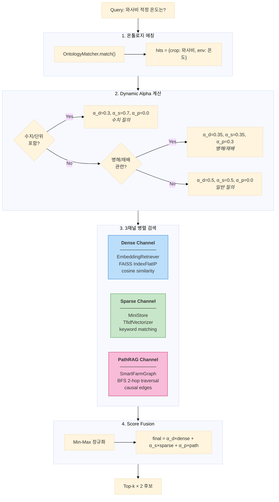
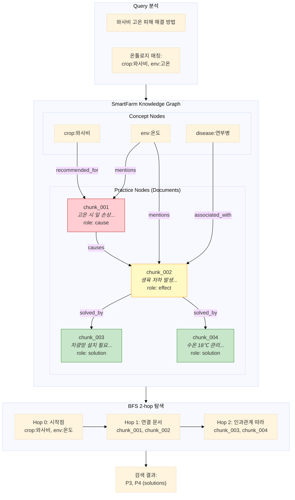
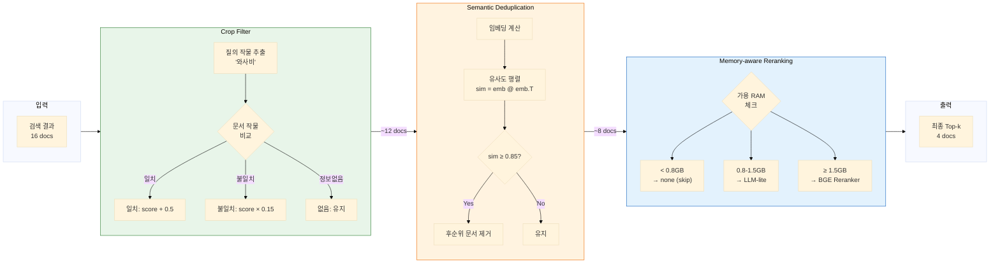
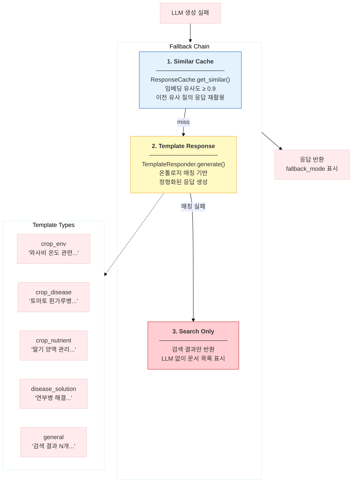
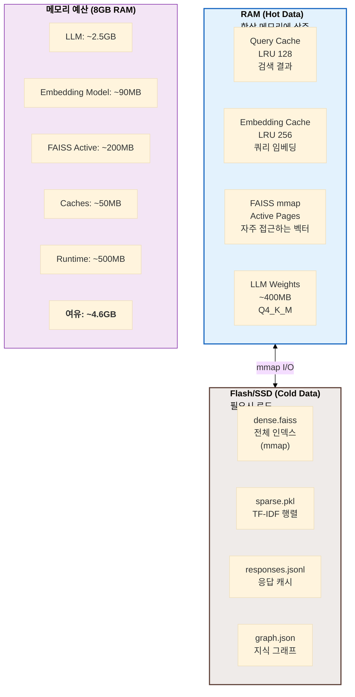
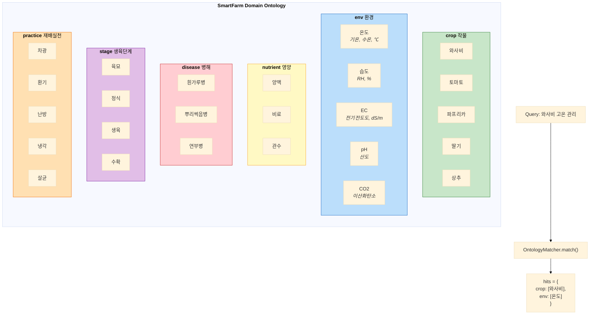
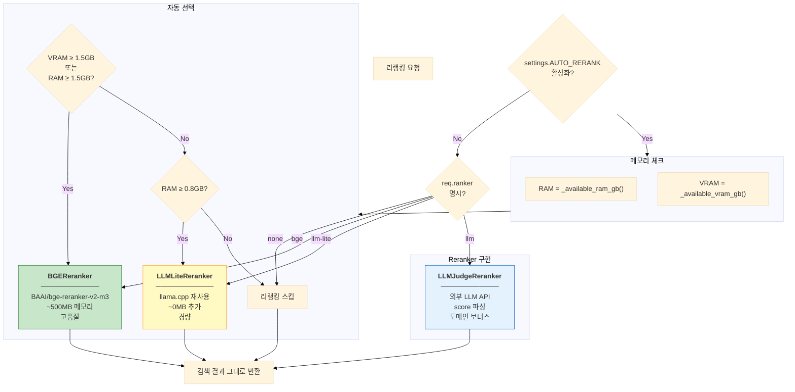
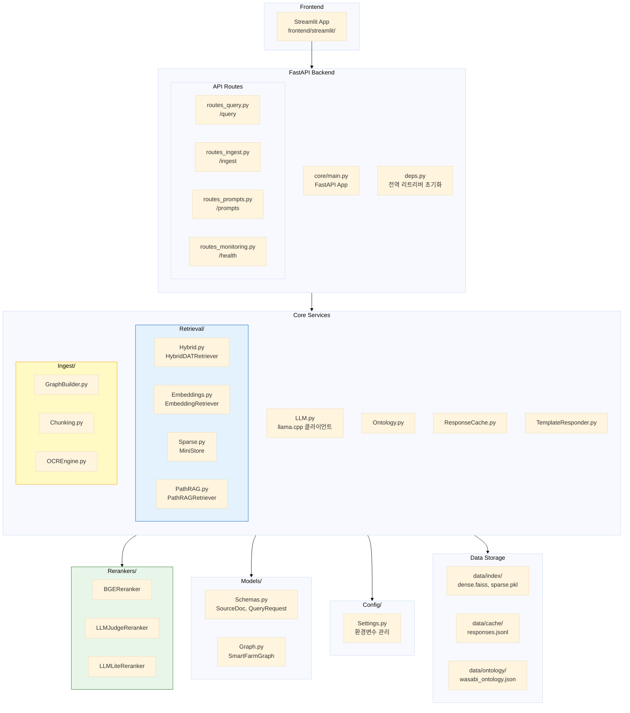

# ERA-SmartFarm-RAG 6-Layer 아키텍처 Mermaid 다이어그램

> **목적**: 디자이너에게 전달하기 위한 시각화 가능한 Mermaid 다이어그램 모음

---

## 1. 전체 시스템 아키텍처 (6-Layer Stack)

```mermaid
%%{init: {'theme': 'base', 'themeVariables': { 'primaryColor': '#e1f5fe', 'primaryTextColor': '#01579b', 'primaryBorderColor': '#0288d1', 'lineColor': '#0288d1', 'secondaryColor': '#fff3e0', 'tertiaryColor': '#f3e5f5'}}}%%

flowchart TB
    subgraph L5["<b>Layer 5: Application & Policy</b>"]
        direction LR
        UI["Streamlit UI<br/>시각화 대시보드"]
        API["FastAPI REST<br/>/query /ingest /health"]
        Policy["Offline Fallback Policy<br/>Cache → Template → Search"]
    end

    subgraph L4["<b>Layer 4: Generation & Grounding</b>"]
        direction LR
        Prompt["Prompt Template<br/>Jinja2 기반"]
        Template["TemplateResponder<br/>온톨로지 기반 폴백"]
    end

    subgraph L3["<b>Layer 3: Context Shaping</b><br/>🎯 논문 핵심 기여"]
        direction LR
        Crop["Crop Filter<br/>+0.5 / ×0.15"]
        Dedup["Semantic Dedup<br/>θ=0.85"]
        Rerank["Memory-aware Reranking<br/>BGE / LLM-lite / none"]
    end

    subgraph L2["<b>Layer 2: Retrieval Core</b><br/>3채널 융합 검색"]
        direction LR
        Dense["Dense<br/>FAISS"]
        Sparse["Sparse<br/>TF-IDF"]
        PathRAG["PathRAG-lite<br/>BFS 2-hop"]
    end

    subgraph L1["<b>Layer 1: On-device Knowledge Store</b>"]
        direction LR
        DenseIdx["dense.faiss<br/>(mmap)"]
        SparseIdx["sparse.pkl"]
        Graph["Causal Graph<br/>causes / solved_by"]
        Onto["Ontology<br/>6 types"]
    end

    subgraph L0["<b>Layer 0: Device & Runtime</b><br/>⚡ 8GB RAM / Q4_K_M"]
        direction LR
        LLM["llama.cpp<br/>Qwen3-0.6B"]
        Embed["Embedding<br/>MiniLM 90MB"]
        FAISS["FAISS<br/>mmap enabled"]
    end

    L5 --> L4
    L4 --> L3
    L3 --> L2
    L2 --> L1
    L1 --> L0

    style L3 fill:#fff9c4,stroke:#f9a825,stroke-width:3px
    style L2 fill:#e3f2fd,stroke:#1976d2,stroke-width:2px
    style L0 fill:#efebe9,stroke:#5d4037,stroke-width:2px
```



---

## 2. Query 처리 플로우 (메인 파이프라인)

```mermaid
%%{init: {'theme': 'base', 'themeVariables': { 'primaryColor': '#e8f5e9', 'primaryTextColor': '#1b5e20'}}}%%

flowchart TD
    Start([/"사용자 질의"/]) --> Cache{"ResponseCache<br/>조회"}
    
    Cache -->|Hit| CacheReturn["캐시 응답 반환<br/>⚡ <10ms"]
    Cache -->|Miss| Retrieval
    
    subgraph Retrieval["Hybrid Retrieval"]
        direction TB
        Onto["온톨로지 매칭<br/>crop/env/disease..."]
        Alpha["Dynamic Alpha 계산<br/>α_d, α_s, α_p"]
        
        subgraph ThreeChannel["3채널 병렬 검색"]
            D["Dense<br/>FAISS ANN"]
            S["Sparse<br/>TF-IDF cosine"]
            P["PathRAG<br/>Graph BFS"]
        end
        
        Fusion["Score Fusion<br/>α_d×D + α_s×S + α_p×P"]
        
        Onto --> Alpha
        Alpha --> ThreeChannel
        ThreeChannel --> Fusion
    end
    
    Retrieval --> Shaping
    
    subgraph Shaping["Context Shaping"]
        direction TB
        CF["Crop Filter<br/>작물 일치 +0.5"]
        SD["Semantic Dedup<br/>유사도 ≥0.85 제거"]
        RR["Reranking<br/>(메모리 적응형)"]
        TopK["Top-k 선택<br/>k=4"]
        
        CF --> SD --> RR --> TopK
    end
    
    Shaping --> LLM{"LLM 생성<br/>llama.cpp"}
    
    LLM -->|성공| Success["정상 응답<br/>+ 캐시 저장"]
    LLM -->|실패| Fallback
    
    subgraph Fallback["Fallback Chain"]
        direction TB
        Similar["1. Similar Cache<br/>임베딩 유사 검색"]
        Tmpl["2. Template Response<br/>온톨로지 기반"]
        Raw["3. Search Only<br/>검색 결과만"]
        
        Similar --> Tmpl --> Raw
    end
    
    CacheReturn --> End([/"응답 반환"/])
    Success --> End
    Fallback --> End

    style Retrieval fill:#e3f2fd,stroke:#1976d2
    style Shaping fill:#fff9c4,stroke:#f9a825
    style Fallback fill:#ffebee,stroke:#c62828
```

---

## 3. HybridDATRetriever 상세 (3채널 융합)



---

## 4. PathRAG-lite 인과관계 그래프 탐색



---

## 5. Context Shaping 상세



---

## 6. 오프라인 폴백 전략



---

## 7. 메모리 계층 구조 (RAM vs Flash)



---

## 8. 온톨로지 구조 (6개 Concept Types)



---

## 9. Reranker 선택 로직



---

## 10. 전체 시스템 컴포넌트 맵



---

## 디자이너 전달 가이드

### 색상 팔레트 (권장)

| Layer | 색상 | HEX | 의미 |
|-------|------|-----|------|
| Layer 0 (Device) | 갈색 | `#efebe9` | 하드웨어/제약 |
| Layer 1 (Storage) | 보라 | `#f3e5f5` | 데이터 저장 |
| Layer 2 (Retrieval) | 파랑 | `#e3f2fd` | 검색 엔진 |
| Layer 3 (Shaping) | 노랑 | `#fff9c4` | **핵심 기여** |
| Layer 4 (Generation) | 초록 | `#e8f5e9` | 생성/응답 |
| Layer 5 (Application) | 회색 | `#fafafa` | UI/API |

### 강조 포인트

1. **Layer 3 (Context Shaping)** - 논문 핵심 기여, 굵은 테두리 또는 하이라이트
2. **Layer 2 (3채널 융합)** - Dense/Sparse/PathRAG 세 갈래 화살표
3. **Layer 0 (리소스 제약)** - "8GB RAM", "Q4_K_M" 뱃지 표시
4. **RAM ↔ Flash 경계선** - Layer 1-2 사이 점선

### Figure 우선순위

| 순위 | 다이어그램 | 용도 |
|------|----------|------|
| 1 | 전체 6-Layer Stack (섹션 1) | 논문 Figure 1 |
| 2 | Query 처리 플로우 (섹션 2) | 논문 Figure 2 |
| 3 | 3채널 융합 상세 (섹션 3) | 보충 자료 |
| 4 | 오프라인 폴백 (섹션 6) | 논문 Figure 3 |
